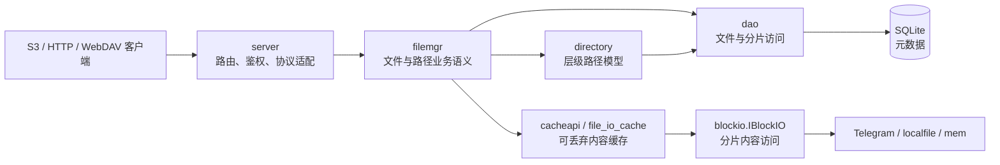

# 系统架构

本文描述 tgfile 当前稳定的系统边界、组件职责和依赖方向。使用与部署方式以
[`README.md`](../README.md) 为准，数据模型与核心流程分别见
[`02-data-and-storage-model.md`](02-data-and-storage-model.md) 和
[`03-core-flows-and-api.md`](03-core-flows-and-api.md)。

## 1. 设计目标

tgfile 是一个面向流式读写的文件服务。它把文件内容切分为若干块，使用可插拔的
BlockIO 后端保存块内容，并在 SQLite 中保存文件、分片和路径映射元数据。

系统的主要设计目标是：

- 以有限内存完成大文件上传、下载和 Range 读取；
- 将外部路径与内部文件内容标识解耦，使一个文件可以被路径引用；
- 将后端返回的块标识作为不透明数据持久化，读取时按原分片顺序恢复内容；
- 允许在不改变文件与路径语义的前提下替换 BlockIO 或缓存实现；
- 保持 S3 GET/HEAD、S3 PUT 和文件直链读取的稳定行为。

## 2. 组件关系

SQLite 保存“内容在哪里”和“路径指向哪个内容”，BlockIO 保存真正的文件字节。缓存仅
保存可重新获取的内容副本，不参与持久化一致性判定。

## 3. 包职责与依赖边界

| 包 | 稳定职责 |
|---|---|
| `cmd` | Cobra 命令定义、配置加载、依赖组装、进程生命周期 |
| `server` | HTTP 路由、鉴权接入、协议与业务模型转换、流式响应 |
| `filemgr` | 文件创建、分片读写、路径链接、复制、移动与删除语义 |
| `directory` | 基于映射表实现目录树和路径操作 |
| `dao` | SQLite 表的读写及元数据缓存 |
| `db` | SQLite 连接、migration 规划与执行、版本账本和 schema 校验 |
| `migrations` | 按版本保存并嵌入二进制的 SQLite schema SQL |
| `blockio` | 分片内容存储接口及 Telegram、localfile、mem 实现 |
| `cacheapi`、`filemgr/file_io_cache.go` | L1/L2 文件内容缓存 |
| `entity` | 持久化访问所需的内部数据结构 |
| `server/model` | HTTP 接口的请求和响应结构 |
| `maintenance` | 不启动在线服务的只读数据库审计 |

依赖必须保持单向：

- `cmd` 可以组装其他包，其他包不得反向依赖 `cmd`；
- handler 通过 `filemgr.IFileManager` 使用业务能力，不直接修改业务表；
- `filemgr` 通过 DAO、Directory、Cache 和 BlockIO 接口访问基础设施；
- 数据模型包不依赖 handler、命令或具体后端实现；
- 离线只读命令不初始化 HTTP 服务、缓存或 BlockIO 后端。

## 4. 在线服务生命周期

`serve` 命令按以下顺序组装服务：

1. 解析配置并初始化日志与 ID 生成器；
2. 打开 SQLite，执行待处理的嵌入式 migration 并校验 schema；
3. 按配置创建 BlockIO，并在需要时增加可逆字节旋转层；
4. 创建 L1/L2 内容缓存和 FileManager；
5. 注册 HTTP 路由并开始监听；
6. 收到终止信号后停止接收请求，等待在途请求退出并关闭数据库。

HTTP 服务为流式上传和下载保留无限的整请求读写时间，但限制请求头读取时间、空闲连接
时间和请求头大小。业务调用应传播 `context.Context`，使客户端取消和服务关闭可以中止
后续工作。

## 5. 稳定扩展点

### 5.1 BlockIO

`blockio.IBlockIO` 定义四项能力：实现名称、单块大小上限、上传一个块和从指定偏移下载
一个块。FileManager 不依赖 Telegram API，只依赖这一接口。

新增后端必须满足：

- `Upload` 返回的 FileKey 可以原样持久化并用于后续 `Download`；
- `Download` 支持块内偏移并返回需要调用方关闭的流；
- `MaxFileSize` 在实例生命周期内保持稳定且大于零；
- 错误保留原因链，并响应调用方 context；
- 不擅自重试可能创建重复对象的非幂等上传。

### 5.2 缓存

缓存位于 BlockIO 之前：

1. 小文件优先查询 L1 内存缓存；
2. 未命中时查询 L2 磁盘缓存；
3. 仍未命中时从 BlockIO 读取，并按大小策略回填缓存；
4. 超出缓存对象上限的文件直接从 BlockIO 流式读取。

缓存键使用内部 `file_id`。清空、淘汰或损坏缓存不得改变 SQLite 元数据或后端块内容。

### 5.3 协议适配

S3、文件直链接口、WebDAV 和备份接口共享 FileManager，不各自实现一套存储规则。新协议
应只负责鉴权、参数校验、状态码映射和流式传输；文件状态、路径冲突、分片和校验和语义
由 FileManager 统一维护。

## 6. 配置边界

配置按职责分为：

- 监听地址与日志；
- SQLite 文件位置；
- BlockIO 类型及其后端参数；
- 上传鉴权用户；
- S3 bucket、WebDAV 根路径等协议开关；
- 可逆字节旋转参数；
- L1/L2 缓存容量、单对象上限和磁盘目录。

凭据仅用于初始化对应组件，不得写入日志、API 响应或设计文档。配置解析和依赖组装属于
`cmd`；业务包不应自行读取配置文件。

## 7. 架构不变量

修改实现时必须保持以下约束，除非先完成明确的新设计和数据迁移：

- SQLite 是元数据事实来源，BlockIO 是内容事实来源，缓存不是事实来源；
- 业务 schema 只通过不可变的版本化 migration 演进，不在 Go 启动逻辑中散落 DDL；
- 路径映射与文件内容分离，删除路径不等于删除后端块；
- FileKey 是后端生成的不透明标识，不解析、不归一化、不静默改写；
- `file_id`、分片顺序、已持久化校验和和外部直链 key 保持兼容；
- 已存在的 S3 对象不被 PUT 静默覆盖；
- 默认直链上传统一映射到 `/defaults` 路径树；
- 任何自动清理能力都不能越过 FileManager 和明确的数据安全边界。
