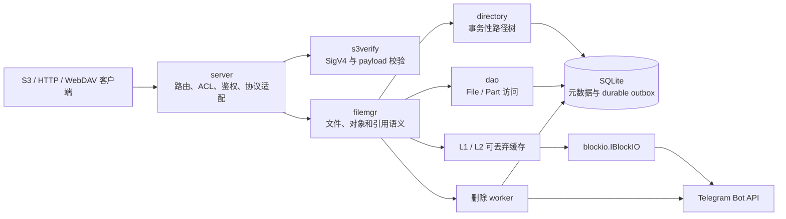

# 系统架构

本文描述 tgfile 当前稳定的系统边界、组件职责和依赖方向。数据模型见
[`02-data-and-storage-model.md`](02-data-and-storage-model.md)，协议语义见
[`03-core-flows-and-api.md`](03-core-flows-and-api.md)。

## 1. 系统定位

tgfile 是一个以 Telegram 为主要内容后端的流式文件服务。文件按 BlockIO 单块上限切分，
块内容存入 Telegram，SQLite 保存文件、分片、路径、S3 元数据和删除任务。一个内部 File
可以被多个 Mapping 引用，因此复制对象不需要重新上传内容。

生产核心能力是：

- S3 PUT、GET、HEAD、Range、ListObjectsV2、CopyObject 和删除；
- 基于 bucket ACL 的公开或私有读取；
- 文件直链上传、下载和元数据读取；
- SQLite migration、只读审计和持久化 Telegram 删除 worker。

WebDAV、逻辑备份和静态目录复用同一 FileManager，但不是 S3 语义的替代实现。

## 2. 组件关系

SQLite 是元数据事实来源，Telegram 是内容事实来源，缓存只保存可重建副本。handler
不得直接写业务表；跨 Mapping、S3 元数据和删除状态的原子操作由 FileManager 与
Directory 事务完成。

## 3. 包职责

| 包 | 稳定职责 |
|---|---|
| `cmd` | Cobra 子命令、配置校验、依赖组装和进程生命周期 |
| `server` | HTTP 路由、bucket ACL、认证、S3/HTTP 协议转换 |
| `filemgr` | 文件创建与读取、S3 对象事务、引用计数判断、删除 worker |
| `directory` | SQLite 路径树及事务内 Stat/Create/Remove/Copy/Move/Touch |
| `dao` | File、Part 和普通 Mapping 数据访问 |
| `db` | migration 规划、账本、checksum 和 schema 指纹校验 |
| `migrations` | 按版本嵌入二进制的业务 DDL 与精确 legacy schema 画像 |
| `blockio` | Telegram、localfile、mem 内容后端及可逆字节旋转 |
| `maintenance` | 不初始化在线依赖的 SQLite 只读审计 |
| `entity`、`server/model` | 内部持久化模型和 HTTP 请求/响应模型 |

依赖方向必须保持单向：`cmd` 负责组装，业务包不反向依赖 `cmd`；数据模型层不依赖
handler；协议层通过 `IFileManager` 使用存储能力。

## 4. 认证与 bucket ACL

每个 server 实例拥有独立、有序的 authenticator，不使用进程级隐式注册。普通受保护
HTTP 路由使用 Basic Auth；S3 接受 Basic Auth 或本地 `s3verify` 校验的 SigV4 header /
presigned query。

bucket 必须显式配置以下 ACL 之一：

- `private`：GET、HEAD、List、PUT、Copy 和 Delete 均要求认证；
- `public-read`：仅对象 GET/HEAD 允许真正匿名访问，其余操作仍要求认证。

客户端一旦提交认证信息，认证失败就返回错误，不能因 bucket 可公开读取而降级为匿名。
未知 bucket 对匿名请求返回 AccessDenied，对已认证请求返回 NoSuchBucket，避免私有部署
被匿名枚举。

## 5. BlockIO 与 Telegram 边界

`blockio.IBlockIO` 提供实现名称、单块上限、上传、按偏移下载和批量删除。上传结果同时
包含：

- `FileKey`：后续下载使用的不透明标识；
- `DeleteRef`：能够定位原 Telegram message 的版本化引用；
- `UploadedAt`：判断 Telegram 删除时限的服务端时间。

Telegram 后端的稳定约束：

- 单块最大 20 MiB；
- 上传是非幂等操作，不自动重试；
- 上传和删除分别串行；相邻上传按配置间隔，相邻删除至少间隔一秒；
- 删除引用绑定当前 bot、chat 和 message，解析时拒绝未知字段和身份不匹配；
- `deleteMessages` 每批最多 100 条，普通消息只能在 Telegram 的 48 小时窗口内删除。

FileKey 和 DeleteRef 都是后端数据，日志和外部响应不得输出其完整值。

## 6. 删除状态机

Telegram 消息删除不是 Mapping 事务中的同步网络调用。S3 DeleteObject、DeleteObjects
或覆盖操作移除最后一个 Mapping 引用时，只把对应 Part 的 durable outbox 状态从 `live`
改为 `pending`。后台 worker：

1. 恢复过期的 `deleting` lease；
2. 按上传时间领取至多 100 个 `pending` Part；
3. 再次确认 File 没有任何 Mapping 引用；
4. 在 47 小时安全截止时间内调用 BlockIO 删除；
5. 根据成功、限流、临时错误或永久错误写入终态或下次重试时间。

读取、启动、migration、audit、普通 Mapping 删除以及缺少 DeleteRef 的历史数据不会触发
Telegram 删除。删除成功后仍保留 File、Part 和删除状态，保证审计与引用安全。

## 7. 在线生命周期

`serve` 的固定顺序是：

1. 解析并完整校验配置；
2. 初始化日志和 ID 生成器；
3. 打开 SQLite，规划并事务性执行 migration，再校验 schema；
4. 创建 BlockIO、缓存和 FileManager；
5. 创建 HTTP server，同时启动删除 worker；
6. 收到终止信号后停止 HTTP 服务、取消 worker 并关闭数据库。

`check-config` 在日志、数据库、网络和缓存初始化之前完成验证。`audit` 使用 SQLite 只读
模式，不执行 migration。

## 8. 架构不变量

- 业务 schema 只通过不可变的 `migrations/NNNN_name.sql` 演进；
- Mapping 与 File 分离，CopyObject 只增加引用，不复制 Telegram 内容；
- S3 Mapping 与对象元数据在同一个 SQLite 事务中创建、覆盖、复制或删除；
- 最后引用判断与 `live -> pending` 状态变化处于同一事务；
- 非 `live` File 不能重新创建 Mapping，worker 发现引用恢复时将可恢复状态改回 `live`；
- 外部直链 key、`file_id`、Part 顺序、FileKey 和已持久化 MD5 不被静默改写；
- 历史 S3 对象没有元数据行时只做惰性兼容读取，不批量回填或改变 ETag；
- 缓存损坏、淘汰或清空不得影响 SQLite 或 Telegram 原始数据。
