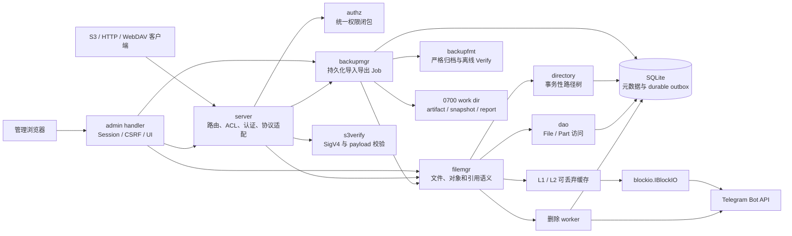

# 系统架构

本文描述 tgfile 当前稳定的系统边界、组件职责和依赖方向。数据模型见
[`02-data-and-storage-model.md`](02-data-and-storage-model.md)，协议语义见
[`03-core-flows-and-api.md`](03-core-flows-and-api.md)，WebDAV 的资源、属性、锁和同步
模型见 [`04-webdav-protocol.md`](04-webdav-protocol.md)。
逻辑备份的归档与恢复状态机见
[`05-logical-backup.md`](05-logical-backup.md)。
Web 管理后台的会话、安全边界和管理接口见
[`06-web-management.md`](06-web-management.md)。

## 1. 系统定位

tgfile 是一个以 Telegram 为主要内容后端的流式文件服务。文件按 BlockIO 单块上限切分，
块内容存入 Telegram，SQLite 保存文件、分片、路径、S3 元数据和删除任务。一个内部 File
可以被多个 Mapping 引用，因此复制对象不需要重新上传内容。

生产核心能力是：

- S3 PUT、GET、HEAD、Range、ListObjects V1/V2、CopyObject 和删除；
- S3 Multipart Upload 的创建、分片上传、列举、完成、终止和过期清理；
- 基于 bucket ACL 的公开或私有读取；
- 文件直链上传、下载和元数据读取；
- SQLite migration、只读审计和持久化 Telegram 删除 worker。

WebDAV、Web 管理后台和逻辑备份复用同一 FileManager。WebDAV 提供 Class 1/2 资源方法、
持久化 dead properties、锁和 collection sync；它可以透明读取 Multipart Composite
File，所有覆盖和删除也复用同一套引用与底层删除语义。

## 2. 组件关系

SQLite 是元数据事实来源，Telegram 是内容事实来源，缓存只保存可重建副本。handler
不得直接写业务表；跨 Mapping、S3 元数据和删除状态的原子操作由 FileManager 与
Directory 事务完成。

## 3. 包职责

| 包 | 稳定职责 |
|---|---|
| `cmd` | Cobra 子命令、配置校验、依赖组装和进程生命周期 |
| `server` | HTTP 路由、bucket ACL、认证、S3/HTTP/WebDAV/管理协议转换 |
| `authz` | 权限注册、配置编译、write/read 与 all 权限闭包、无状态授权查询 |
| `server/handler/admin` | 内嵌管理 UI、Session、CSRF、角色校验和管理 API |
| `filemgr` | 文件创建与读取、S3/Multipart/WebDAV 事务、Composite、引用判断和后台 worker |
| `directory` | SQLite 路径树、分页遍历及事务内 Stat/Create/Replace/Remove/Copy/Move/Touch |
| `dao` | File、Part 和普通 Mapping 数据访问 |
| `db` | migration 规划、账本、checksum 和 schema 指纹校验 |
| `migrations` | 按版本嵌入二进制的业务 DDL 与精确 legacy schema 画像 |
| `s3checksum` | S3 checksum 算法、Base64 摘要校验、CRC 合并和 Composite 聚合 |
| `blockio` | Telegram、localfile、mem 内容后端及可逆字节旋转 |
| `maintenance` | 不初始化在线依赖的 SQLite 只读审计 |
| `backupfmt` | 独立于数据库和后端的 `.tgfb` 格式、摘要及资源限制 |
| `backupmgr` | 逻辑备份 Job、幂等、异步执行、恢复、清理和低基数指标 |
| `entity`、`server/model` | 内部持久化模型和 HTTP 请求/响应模型 |

依赖方向必须保持单向：`cmd` 负责组装，业务包不反向依赖 `cmd`；数据模型层不依赖
handler；协议层通过 `IFileManager` 使用存储能力。

## 4. 认证、统一授权与 bucket ACL

每个 server 实例拥有独立、有序的 authenticator，不使用进程级隐式注册。普通受保护
HTTP 路由使用 Basic Auth；S3 接受 Basic Auth 或本地 `s3verify` 校验的 SigV4 header /
presigned query。`user_info` 是唯一凭据来源；同级 `user_permission` 是唯一授权来源，
两个对象的用户名集合必须完全一致。各 handler 只接收组装阶段创建的同一只读 Authorizer，
不维护自己的用户角色映射。

权限固定为 `s3:read/write`、`webdav:read/write`、`backup:read/write`、
`admin:read/write`、`file:write`、`all:read` 和 `all:write`。协议 write 权限蕴含同协议
read；`all:read` 蕴含所有读能力，`all:write` 蕴含全部能力。`file:write` 同时控制
`/file/upload` 和 `/file/purge`。不存在无命名空间的 `all` 或 `file:read`。
配置中的未知权限、重复权限、空权限数组、账号集合不一致和旧的功能级 `users` 字段都会在
初始化数据库、BlockIO 或 HTTP 服务前失败。

bucket 必须显式配置以下 ACL 之一：

- `private`：GET、HEAD、List、PUT、Copy 和 Delete 均要求认证；
- `public-read`：仅对象 GET/HEAD 允许真正匿名访问，其余操作仍要求认证。

客户端一旦提交认证信息，认证失败就返回错误，不能因 bucket 可公开读取而降级为匿名。
public-read 对象读取若携带有效凭据，该用户仍必须具备 `s3:read`；所有 S3 写操作要求
`s3:write`。Header 签名、presigned query 和 Basic Auth 经过相同权限判断。
未知 bucket 对匿名或无对应 S3 权限的请求返回 AccessDenied，对具备所需 S3 权限的认证
请求返回 NoSuchBucket，避免私有部署被匿名枚举。

`/_admin/` 不使用 Basic Auth 或 S3 签名。它使用 `user_info` 校验登录密码，再由
`admin:read` / `admin:write` 动态派生管理角色，并签发进程内 HttpOnly Session Cookie。
管理权限不扩展 S3、WebDAV 或直接 Backup API 的权限，反向亦然。

## 5. BlockIO 与 Telegram 边界

`blockio.IBlockIO` 提供实现名称、单块上限、上传、按偏移下载和批量删除。上传结果同时
包含：

- `FileKey`：后续下载使用的不透明标识；
- `DeleteRef`：能够定位原 Telegram message 的版本化引用；
- `UploadedAt`：判断 Telegram 删除时限的服务端时间。

Telegram 后端的稳定约束：

- 单块最大 20 MiB；
- 上传是非幂等操作，不自动重试；
- 上传和删除分别串行；相邻上传按配置间隔，相邻删除至少间隔一秒；
- 删除引用绑定当前 bot、chat 和 message，解析时拒绝未知字段和身份不匹配；
- `deleteMessages` 每批最多 100 条，普通消息只能在 Telegram 的 48 小时窗口内删除。

FileKey 和 DeleteRef 都是后端数据，日志和外部响应不得输出其完整值。

## 6. 文件内容缓存

所有需要内容的读取入口都通过 `FileManager.OpenFile` 使用同一个两级整文件缓存。缓存 key
不是 FileID，而是带格式版本的 SHA-256 身份：它包含当前存储绑定、FileID、声明大小、
Part 数、File 状态、layout、创建/修改时间和扩展信息。存储绑定由规范化数据库路径、
数据库的稳定 OS 文件身份、BlockIO 类型与配置以及 rotate 参数导出；不支持稳定文件身份的
平台使用进程随机身份，因此不做跨重启命中。manifest 和日志都不保存 BlockIO 明文配置或
凭据。

L1 和 L2 按互斥大小区间判断资格。启用 L1 时，文件大小不超过 L1 单文件上限就只进入 L1；
超过 L1 上限后，才会在启用 L2 且不超过 L2 单文件上限时进入 L2。两层同时启用且 L1 上限
大于或等于 L2 上限时，L2 没有有效区间，配置规范化会停用 L2，也不会创建或锁定磁盘目录。
两层都不符合时直接返回 BlockIO stream，不做整文件缓冲。符合任一层时，同一身份在一个
进程内只有一个 fill leader；其他请求等待 leader 完成后重新获取独立 reader。等待者可以按
自己的 context 取消，不会取消 leader；不同身份的回填互不串行。只有精确读到声明长度、
并确认没有额外字节的内容才能发布到任一层。

L1 使用进程内 weighted cache 保存不可变字节副本，容量同时计入 entry 的内部管理成本。
L2 是
`<l2_cache_dir>/v2/<key-prefix>/<key>.<generation>.<size>.<sha256>.cache` 下的持久化副本：

- `v2/.manifest` 绑定当前存储实例；缺失、损坏或绑定变化时旧 entry 不会被接管；
- `v2/.lock` 对目录加非阻塞独占锁，一个目录只能由一个进程管理；
- candidate 先在目标 shard 写唯一 temp，精确复制并同步后，以 UUID generation 原子发布；
- 同步 weighted LRU 按 4 KiB 分配单元向上计费，同一 key 的旧 generation 只会被 retire；
- reader 在 policy 锁内取得引用，entry 被淘汰或失效后要等最后一个 reader 关闭才物理删除；
- 关闭缓存会等待正在执行的 Load 和 L2 reader、停止 L1、重试 orphan 清理并释放目录锁，
  但保留正常 admitted 文件供下次启动恢复。

启动恢复不跟随 symlink，只接管 shard、文件名、大小、普通文件类型和内容摘要都匹配的 entry；
同 key 的多个 generation 按固定字典序选择一个，其余安全清理。热命中执行 open 和 fstat；
文件身份、mtime 或大小变化时重新校验摘要。缓存文件丢失、损坏、淘汰、磁盘写入失败或
admission 拒绝都只产生 miss/fallback；只要 BlockIO 回源仍可成功，就不能把读取变成失败。
数据源短读、超长读或 loader 错误仍返回保留原因链的读取错误，不能发布缓存。

L2 文件名中的完整身份摘要、generation、逻辑大小和内容摘要分别用于身份隔离、原子发布、
恢复校验和损坏检测，因此不截短这些字段，也不依赖额外 sidecar。文件名与 inode 的固定开销
通过互斥分层避免落盘 L1 小文件，并通过最小 4 KiB 计费纳入淘汰预算；启用 L1 后，启动恢复
会清理大小落入 L1 区间的旧 L2 entry。

L2 目录不能与数据库、localfile 原始块、备份 work dir 或 WebDAV spool 重叠。缓存清理只
处理规范化受管目录内的 v2 cache/temp 和严格识别的旧格式副本，不写业务表、不改变 Mapping、
Part 或 durable outbox，也不调用 BlockIO 删除。

## 7. Composite 与删除状态机

普通上传生成 layout v1 File，其 Telegram Part 直接记录在 `tg_file_part_tab`。Multipart
的每个 S3 part 也是一个 layout v1 File；Complete 只创建 layout v2 Composite File，
按顺序引用这些 source File，不重新下载或上传 Telegram message。所有读取入口最终都通过
`FileManager.OpenFile`，因此 S3、直链、WebDAV、管理后台和备份可以透明读取两种 layout。

S3 additional checksum 的计算边界是 S3 Part 和最终对象，不是 Telegram message。
UploadPart 在流式写入 Telegram 的同时计算并校验 checksum；Complete 只读取 SQLite 中
保存的 Part checksum 和 size，通过 CRC combine 或原始摘要聚合得到最终值。checksum
算法实现不依赖 HTTP、SQLite、FileManager 或 Telegram。

Telegram 消息删除不是 Mapping 事务中的同步网络调用。以下操作在失去最后有效引用后，
只把对应 Part 的 durable outbox 状态从 `live` 改为 `pending`：

- S3 DeleteObject、DeleteObjects 和对象覆盖；
- WebDAV DELETE，以及 COPY/MOVE 覆盖的目标子树；
- Multipart Abort、过期、相同 PartNumber 替换、Complete 未选择和上传失败补偿。

后台 worker：

1. 恢复过期的 `deleting` lease；
2. 按上传时间领取至多 100 个 `pending` Part；
3. 再次确认 File 没有直接 Mapping、已发布 Composite 或 active Multipart 引用；
4. 在 47 小时安全截止时间内调用 BlockIO 删除；
5. 根据成功、限流、临时错误或永久错误写入终态或下次重试时间。

读取、List、HEAD、PROPFIND、启动、migration、audit、无删除/覆盖的 Mapping 操作以及
缺少 DeleteRef 的历史数据不会触发 Telegram 删除。删除成功后仍保留 File、Part 和删除
状态，保证审计与引用安全。

## 8. 在线生命周期

`serve` 的固定顺序是：

1. 解析并完整校验配置；
2. 初始化日志和 ID 生成器；
3. 打开 SQLite，规划并事务性执行 migration，再校验 schema；
4. 创建 BlockIO、缓存和 FileManager；
5. 创建 HTTP server，同时启动 Telegram 删除 worker、Multipart 过期清理 worker；启用
   backup 或 Web 管理后台时再启动一个 Export、一个 Import 和周期清理 worker；
6. 任一组件非预期退出时取消其他组件并使服务退出；
7. 收到终止信号后停止 HTTP 服务并取消 worker，等待缓存 fill/reader 后关闭缓存，最后关闭
   数据库。

`check-config` 在日志、数据库、网络和缓存初始化之前完成验证。`audit` 使用 SQLite 只读
模式，不执行 migration。

## 9. 架构不变量

- 业务 schema 只通过不可变的 `migrations/NNNN_name.sql` 演进；
- Mapping 与 File 分离，CopyObject 只增加引用，不复制 Telegram 内容；
- Multipart Complete 只创建 layout v2 manifest 和最终 Mapping，不执行 Telegram I/O；
- Multipart checksum algorithm/type 在 Create 时固化，Part 与最终 checksum 必须和对象
  Metadata 在同一事务中持久化；
- S3 Mapping 与对象元数据在同一个 SQLite 事务中创建、覆盖、复制或删除；
- WebDAV PUT/DELETE/COPY/MOVE 在同一事务中处理 Mapping、属性、锁、对象元数据、
  change journal 和删除 outbox；
- 最后引用判断与 `live -> pending` 状态变化处于同一事务；
- 非 `live` File 不能重新创建 Mapping，worker 发现引用恢复时将可恢复状态改回 `live`；
- 外部直链 key、`file_id`、Part 顺序、FileKey 和已持久化 MD5 不被静默改写；
- 历史 S3 对象没有元数据行时只做惰性兼容读取，不批量回填或改变 ETag；
- 逻辑 Export Pin 参与最后引用判断；Import staged File 在原子发布前没有 Mapping；
- 逻辑恢复保留路径、Part/Segment/Completed Part 和协议元数据，但生成新的 FileID、
  EntryID、FileKey 和 DeleteRef；
- 缓存身份必须同时绑定存储实例和不可变 File 版本，单独 FileID 不能形成命中；
- 缓存损坏、淘汰、清空或回填失败不得影响 SQLite、Telegram/localfile 原始数据、Mapping、
  Part 或删除状态机。
