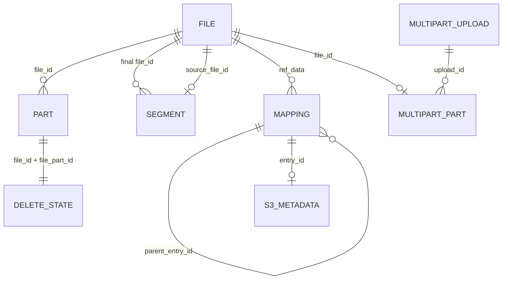
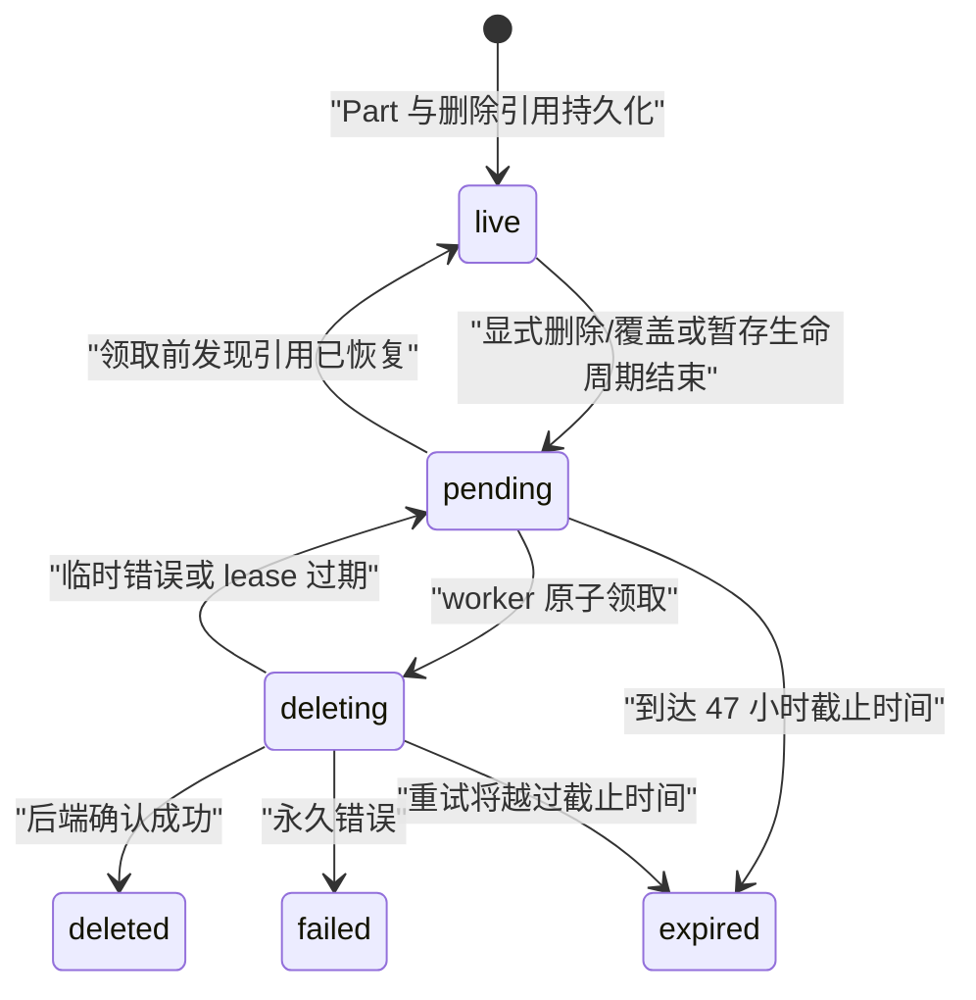

# 数据与存储模型

本文定义 tgfile 的持久化对象、关系、状态和兼容性不变量。组件职责见
[`01-architecture.md`](01-architecture.md)，接口流程见
[`03-core-flows-and-api.md`](03-core-flows-and-api.md)。

## 1. 对象关系



- File 是内部内容对象；
- Part 是按顺序保存的后端块；
- Segment 是 layout v2 Composite File 对 layout v1 source File 的有序引用；
- Mapping 是路径树条目，文件条目通过十进制 `ref_data` 引用 File；
- S3 Metadata 绑定具体 Mapping，不绑定 File，因此同一内容的不同对象可以拥有不同元数据；
- Multipart Upload/Part 保存未完成上传和完成幂等所需的控制状态；
- Delete State 绑定 Part，保存可删除 Telegram message 的引用和 durable worker 状态。

数据库不使用外键表达这些关系，完整性由事务、唯一约束、审计和 FileManager 维护。

## 2. 业务表

### 2.1 `tg_file_tab`

| 字段 | 语义 |
|---|---|
| `file_id` | 内部稳定标识，唯一 |
| `file_size` | 完整文件字节数 |
| `file_part_count` | 按 BlockIO 单块上限计算的分片数 |
| `file_layout_version` | `1` 为物理 File，`2` 为 Composite File |
| `file_state` | 创建中或已就绪 |
| `extinfo` | JSON 扩展信息，包含兼容性文件 MD5 |
| `ctime`、`mtime` | 创建和修改时间 |

### 2.2 `tg_file_part_tab`

`(file_id, file_part_id)` 唯一，`file_part_id` 从零开始。本表只保存 layout v1 的物理
BlockIO Part；layout v2 不复制这些行。

| 字段 | 语义 |
|---|---|
| `file_key` | BlockIO 下载使用的不透明标识 |
| `file_part_md5` | 分片内容 MD5，属于存量格式 |
| `ctime`、`mtime` | 创建和修改时间 |

零字节 File 没有 Part。单分片 File 的文件级 MD5 等于分片 MD5；多分片 File 对按顺序
拼接的分片 MD5 十六进制文本再计算 MD5。MD5 只用于协议和存量兼容，不用于认证。

### 2.3 `tg_file_mapping_tab`

| 字段 | 语义 |
|---|---|
| `entry_id` | 路径条目的稳定标识 |
| `parent_entry_id`、`file_name` | 父子层级和当前层名称 |
| `file_kind` | `1` 为目录，`2` 为文件 |
| `ref_data` | 文件条目保存十进制 `file_id`，目录为空 |
| `file_size`、`file_mode` | 路径侧元数据 |
| `ctime`、`mtime` | 创建和修改时间 |

根条目为 `(parent_entry_id=0, file_name='/')`。`(parent_entry_id, file_name)` 和
`entry_id` 都有唯一约束。一个 File 可以被多个 Mapping 引用；是否允许删除 Telegram
内容由所有 Mapping 的最终引用判断决定。

### 2.4 `tg_s3_file_segment_tab`

layout v2 File 通过本表顺序引用 layout v1 source File：

| 字段 | 语义 |
|---|---|
| `file_id` | layout v2 final File |
| `segment_index` | 从 0 连续递增的逻辑顺序 |
| `source_file_id` | ready、layout v1 的 source File，全表唯一 |
| `segment_size` | source File 的完整大小 |
| `ctime`、`mtime` | manifest 记录时间 |

final File 的 `file_size` 必须等于所有 Segment Size 之和，`file_part_count` 必须等于所有
source File 物理 Part 数之和。Segment 不允许递归引用 layout v2。Complete 写入 final
File、Segment、Mapping、S3 Metadata 和 Multipart 状态的操作处于同一事务。

### 2.5 Multipart 控制表

`tg_s3_multipart_upload_tab` 保存 bucket/key、`active/completing/completed/aborted` 状态、
创建时对象元数据、发起/过期/完成/清理时间，以及 Complete 幂等所需的 fingerprint、
result FileID 和 Multipart ETag。

`tg_s3_multipart_part_tab` 的 `(upload_id, part_number)` 为主键，保存：

- `active/selected/discarded` 状态；
- 对应 layout v1 暂存 FileID；
- S3 part 的真实大小、原文 MD5 ETag 和上传时间。

PartNumber 为 1～10000，单 part 最大 5 GiB。一个暂存 File 只能属于一个 Multipart Part。
active upload 和 completed/aborted 控制记录分别在 24 小时有效期与保留期后由专用 worker
处理；清理控制行不会删除 final File、Segment、Mapping、Telegram Part 或删除审计记录。

### 2.6 `tg_s3_object_metadata_tab`

每个新 S3 对象 Mapping 对应一行：

| 字段 | 语义 |
|---|---|
| `entry_id` | 对应 Mapping 主键 |
| `etag` | 完整 HTTP ETag 文本 |
| `checksum_sha256` | 服务端对对象原文计算的 Base64 SHA-256 |
| `request_checksum_algorithm/value` | 客户端显式提交且验证成功的 checksum |
| `content_type`、`cache_control` | 标准响应元数据 |
| `content_disposition/encoding/language` | 可选内容元数据 |
| `expires` | 规范化 HTTP date |
| `user_metadata` | 规范化后的 `x-amz-meta-*` JSON |
| `ctime`、`mtime` | 对象元数据时间 |

新 PUT 的 ETag 是对象原文 MD5 的小写十六进制强 ETag。CopyObject 的 COPY 模式复制源
元数据，REPLACE 模式替换可写元数据但保留内容 ETag 和 checksum。

Multipart 最终对象的 ETag 为标准组合值：

```text
hex(MD5(binary_md5(part1) || ... || binary_md5(partN))) + "-" + N
```

它不是整对象 MD5，因此 layout v2 File 的 `extinfo` 为 `{}`，普通文件元数据接口不把
Multipart ETag 冒充 MD5。

历史 Mapping 可能没有本表记录。读取时惰性生成：

- ETag：`W/"{file_id}"`；
- Content-Type：按扩展名推断，失败时为 `application/octet-stream`；
- Cache-Control：`public, max-age=604800`；
- 时间：使用 Mapping 时间。

惰性兼容不写数据库，也不改变历史内容和外部标识。

### 2.7 `tg_file_part_delete_state_tab`

`(file_id, file_part_id)` 为主键。

| 字段 | 语义 |
|---|---|
| `backend_kind` | 创建该 Part 的 BlockIO 实现名 |
| `delete_ref` | 版本化、不透明的后端删除引用 |
| `uploaded_at` | 后端确认的上传时间 |
| `delete_state` | `live/pending/deleting/deleted/expired/failed` |
| `attempt_count` | 已领取次数 |
| `next_attempt_at` | 下次可领取时间 |
| `lease_until` | `deleting` 租约截止时间 |
| `last_attempt_at/error_code` | 最近尝试的低基数结果 |
| `deleted_at` | 删除成功时间 |
| `ctime`、`mtime` | 状态记录时间 |

Part 与 Delete State 在同一个事务中插入；如果事务失败，FileManager 立即尝试补偿删除刚
上传的 message。带 Delete State 的 File 重新建立 Mapping 前必须确认已有状态均为
`live`；layout v2 的每个 source File 还必须为每个物理 Part 保存一条完整的 `live`
Delete State。历史 layout v1 File 缺少 Delete State 时继续允许存量 Copy，但无法承诺
物理删除 Telegram message。

状态变化：



终态不会自动清除 File/Part。普通 purge 也不能删除拥有 Delete State 的记录。

## 3. Migration 账本

`schema_migrations` 保存 `version`、`filename`、SQL 原文 SHA-256 和 `applied_at`。
业务 DDL 位于 `migrations/NNNN_name.sql`，按版本升序执行，SQL 和账本写入处于同一事务。

启动规划规则：

- 空库从 0001 初始化；
- 无账本数据库只在 schema 指纹精确匹配内置历史版本或明确 legacy 画像时建立基线；
- 已登记 migration 的文件名和 checksum 必须与二进制完全一致；
- 版本缺口、未知 migration、schema 漂移或无法识别的旧库都安全失败；
- 已发布 migration 不修改、删除、重命名或换序，新 DDL 只追加更高版本。

连接级 `busy_timeout` 属于运行参数，不属于业务 migration。

## 4. 路径与对象事务

S3 PUT、CopyObject、DeleteObject、Multipart Complete 和覆盖在 Directory 事务内完成：

- 最终条件检查；
- Mapping 创建、替换或删除；
- S3 Metadata 创建、复制、替换或删除；
- 被替换 File 的最终引用判断；
- 必要时把该 File 的 `live` Part 状态改为 `pending`。

同进程 path lock 减少冲突，SQLite 唯一约束和事务是跨进程最终一致性边界。

CopyObject 只创建指向同一 File 的新 Mapping。删除任一非最后引用不会改变 Delete State。

WebDAV DELETE 以及覆盖式 COPY/MOVE 也使用 FileManager 的 Directory 事务。目录操作递归
收集旧子树的所有文件，原子更新 Mapping 与 S3 Metadata，再按去重后的 FileID 判断最后
引用。事务提交后才返回，Telegram 网络删除由 worker 异步执行。

layout v1 File 的有效引用包括直接 Mapping、仍有 Mapping 的 Composite Segment 和 active
Multipart Part。layout v2 final File 的有效引用是 Mapping。删除 layout v2 的最后
Mapping 时逐一检查 source File；仍被有效 Mapping/Composite/active upload 引用的 source
不得进入 `pending`。

## 5. 直链 key

直链外部 key 格式为：

```text
{16 位小写十六进制 file_id 哈希}-{清洗和限长后的文件名}
```

内部规范路径为：

```text
/defaults/{哈希前两位}/{完整外部 key}
```

下载只解析该路径，不扫描其他根目录，也没有历史 fallback。`/defaults`、外部 key、FileKey、
`file_id` 和 Part 顺序是数据兼容边界。

## 6. 审计指标

只读 audit 除基础 File/Part/Mapping 完整性外，还报告：

- S3 Metadata 总数、孤立 Metadata 和每个 bucket 缺少 Metadata 的历史 Mapping 数；
- Delete State 各状态数量、最老 pending、过期 lease、48 小时内可处理数；
- Delete State 缺少 Part、backend kind 不匹配；
- private bucket FileID 是否同时出现在 public-read bucket 或 `/defaults`。
- Multipart upload/part 状态、过期 active upload、长期 completing 和孤立控制行；
- layout v2 manifest 连续性、Size/Part 数、source 状态与引用删除状态；
- 有效引用指向非 live File、无引用但仍 live 的暂存 File。

共享 FileID 指标用于发现 private 内容的其他公开入口；它不会自动修改 Mapping 或 ACL。

## 7. 数据兼容性不变量

不能静默改写：

- `file_id`、Part 顺序、FileKey、DeleteRef；
- 已持久化的文件/分片 MD5；
- Mapping 层级和 `ref_data`；
- 历史弱 ETag 和新对象强 ETag；
- 历史 File 的 layout 默认值 `1`，以及 Multipart 组合 ETag；
- 直链 key 与 `/defaults` 映射；
- 已有内容使用的字节旋转参数。

改变这些值必须提供可重复迁移、停服前置检查、备份恢复和迁移后验证。
