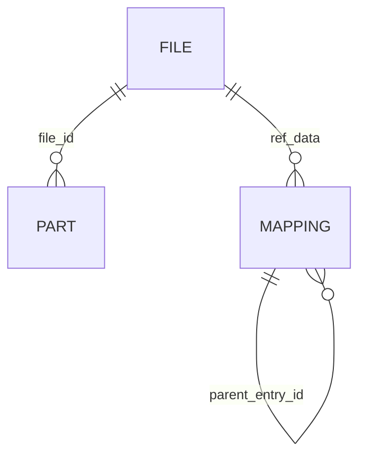
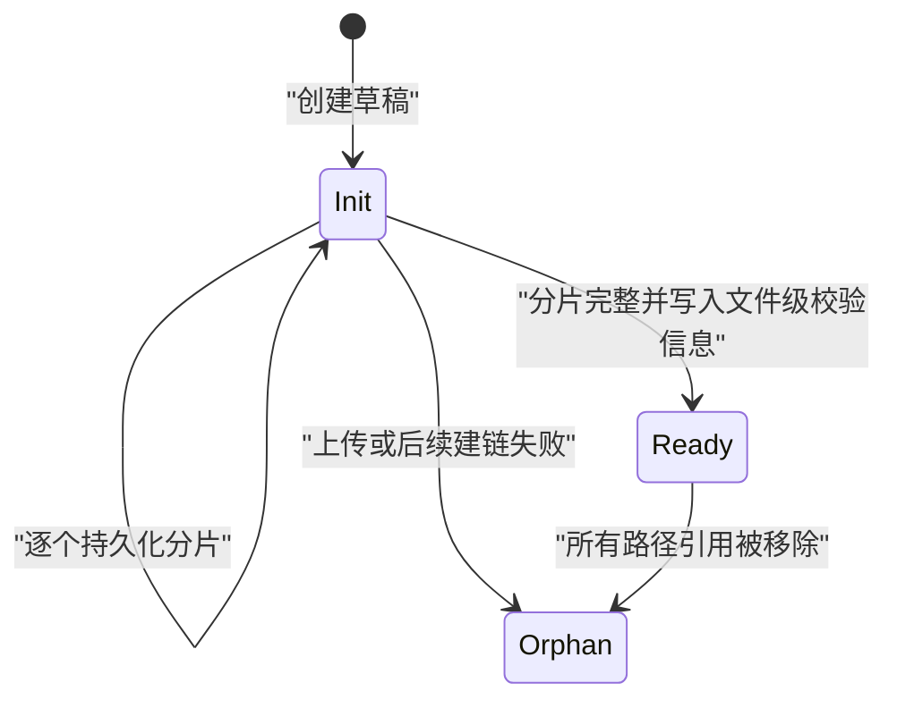

# 数据与存储模型

本文定义 tgfile 的持久化对象、对象间关系和兼容性不变量。组件职责见
[`01-architecture.md`](01-architecture.md)，接口流程见
[`03-core-flows-and-api.md`](03-core-flows-and-api.md)。

## 1. 三类核心对象

tgfile 将一个可访问文件拆分为三个概念：

- **File**：内部文件对象，记录总大小、分片数、状态和文件级校验信息；
- **Part**：文件的有序分片，记录 BlockIO 返回的 FileKey 和分片校验和；
- **Mapping**：目录树中的路径条目，目录条目构成树，文件条目通过 `ref_data`
  引用内部 `file_id`。

它们的逻辑关系如下：



数据库未使用外键表达这些关系，完整性由 FileManager、Directory 和唯一约束共同维护。

## 2. SQLite 表

### 2.1 `tg_file_tab`

每行代表一个内部文件对象。

| 字段 | 语义 |
|---|---|
| `file_id` | 对外部后端无意义的内部稳定标识，唯一 |
| `file_size` | 完整文件字节数 |
| `file_part_count` | 按 BlockIO 单块上限计算出的分片数 |
| `file_state` | 文件创建状态 |
| `ctime`、`mtime` | 创建和最后修改时间 |
| `extinfo` | JSON 扩展信息，当前包含文件级 MD5 |

### 2.2 `tg_file_part_tab`

每行代表一个有序分片，`(file_id, file_part_id)` 唯一。

| 字段 | 语义 |
|---|---|
| `file_id` | 所属内部文件 |
| `file_part_id` | 从零开始的分片序号 |
| `file_key` | BlockIO 返回的不透明持久化标识 |
| `file_part_md5` | 当前分片内容的 MD5 |
| `ctime`、`mtime` | 创建和最后修改时间 |

### 2.3 `tg_file_mapping_tab`

每行代表一个目录或文件路径条目。

| 字段 | 语义 |
|---|---|
| `entry_id` | 当前条目的稳定标识 |
| `parent_entry_id` | 父目录条目标识 |
| `file_name` | 当前层级内的名称 |
| `file_kind` | `1` 表示目录，`2` 表示文件 |
| `ref_data` | 文件条目保存十进制 `file_id`，目录条目为空 |
| `file_size`、`file_mode` | 路径条目的大小和模式元数据 |
| `ctime`、`mtime` | 创建和最后修改时间 |

`(parent_entry_id, file_name)` 唯一，是跨进程路径冲突的最终约束。根目录名称为 `/`，
父条目标识为 `0`。

### 2.4 `schema_migrations`

该表是 schema 版本账本，不保存业务数据。

| 字段 | 语义 |
|---|---|
| `version` | migration 的整数版本，主键 |
| `filename` | 被执行的 SQL 文件名，唯一 |
| `checksum` | SQL 文件原始内容的 SHA-256 |
| `applied_at` | migration 提交时间 |

业务 DDL 位于根目录 `migrations/`，文件名使用 `NNNN_name.sql`。SQL 文件嵌入服务二进制，
启动时按版本升序执行；每个文件的 SQL 与账本写入处于同一个事务中。已经登记的版本必须与
当前二进制中的文件名和 checksum 完全一致，因此已发布 migration 不得修改、删除或换序，
后续 schema 变化只能追加更高版本。

首次接管没有账本的数据库时，执行器先进行只读 schema 指纹比对：

- 空数据库从第一个 migration 开始初始化；
- 能精确匹配历史基础 schema 的数据库登记已有版本，再执行缺少的版本；
- 由旧版硬编码 DDL 产生、但与正式历史版本不完全相同的已知 schema，必须在
  `migrations/legacy/` 中保存独立兼容画像，不能在 Go 代码中放宽通用校验；
- 无法识别、只有部分表或发生 schema 漂移的数据库拒绝继续，不自动删除、重建或猜测性
  修复业务数据。

历史 migration 先表达线上实际经历过的可空字段、索引、`extinfo` 和 `file_part_md5`
演进，再通过后续版本事务性重建三张业务表，将所有数据库统一到当前非空约束。重建必须
显式复制主键和全部业务字段，并在旧表删除前由新表约束验证数据；任一复制失败都会回滚
该版本。`busy_timeout` 等连接级 PRAGMA 属于运行参数，不属于业务 schema migration。

## 3. 文件创建状态

文件创建遵循以下状态流：



`Init` 和 `Ready` 是持久化状态；图中的 `Orphan` 表示“没有 Mapping 引用”的关系状态，
不是单独的 `file_state` 值。

创建文件时先写入 File 草稿，再按序上传并写入 Part。只有读取到声明的完整字节数且全部
Part 已持久化后，File 才会变为 `Ready`。路径 Mapping 在文件就绪后单独创建，因此失败
可能留下未被路径引用的 File 和后端块。

## 4. 分片与校验和

分片大小由 BlockIO 的 `MaxFileSize()` 决定。除最后一片外，各 Part 的长度均等于该上限；
最后一片为剩余字节。零字节文件没有 Part。

每个 Part 保存其内容 MD5。文件级 MD5 是已有持久化协议的一部分：

- 单分片文件：使用该分片的 MD5；
- 多分片文件：按分片顺序拼接各分片 MD5 的十六进制文本，再计算一次 MD5；
- 零分片文件：保存空值。

这些 MD5 用于兼容性和元数据表达，不应被视为安全哈希或身份认证机制。修改算法需要同步
考虑所有存量 `extinfo` 和 S3 ETag 使用方，不能静默重算。

## 5. 路径与直链 key

一般协议路径直接映射到 Mapping 目录树。文件直链接口额外生成一个外部 key：

```text
{16 位小写十六进制 file_id 哈希}-{清洗和限长后的文件名}
```

内部 Mapping 路径固定为：

```text
/defaults/{哈希前两位}/{完整外部 key}
```

下载时仅根据 key 反推出该规范路径，不扫描其他目录，也不使用历史路径回退。解析器必须
校验长度、分隔符、小写十六进制前缀以及后缀中的路径分隔符和控制字符。

外部 key 一旦返回给调用方就成为稳定标识。生成算法、`/defaults` 根路径或 key 到路径的
映射规则如需变化，必须提供对存量 key 的迁移方案。

## 6. BlockIO 内容模型

FileKey 由具体 BlockIO 生成并存入 Part。它可能是 Telegram 文件标识、本地文件路径或
测试后端标识；上层一律将其当作不透明字符串。

可选的字节旋转层在上传前变换内容，在下载后执行逆变换。它是存储格式的一部分，不提供
密码学安全性。修改或关闭已有数据使用的旋转参数会使对应后端块无法正确解码，因此配置
变更必须与存量数据格式保持一致。

当前 BlockIO 接口没有删除方法。删除 Mapping 或 SQLite 中的 File/Part 元数据不会删除
后端对象；在缺少独立审计、备份和可恢复清理设计时，不应假设后端空间会被自动回收。

## 7. 缓存模型

- L1 使用内存保存满足大小限制的完整文件字节；
- L2 使用本地磁盘保存满足大小限制的完整文件副本；
- 两级缓存都以 `file_id` 为键并按容量淘汰；
- L2 使用临时文件写入后原子替换，启动时可重新索引有效缓存文件；
- 缓存未命中、被清空或文件损坏时，系统仍可通过 Part 元数据和 BlockIO 重建内容。

缓存目录不属于备份数据，不能作为 SQLite 或 BlockIO 的恢复来源。

## 8. 数据兼容性不变量

下列值都可能被存量数据或外部调用方引用，不能静默改变：

- `file_id`；
- `(file_id, file_part_id)` 的分片顺序；
- Part 的 FileKey；
- 文件和分片的已持久化 MD5；
- Mapping 的层级关系和文件 `ref_data`；
- 外部直链 key 及其 `/defaults` 规范路径；
- 已有后端块所使用的字节旋转格式。

需要改变这些值时，应先定义可重复执行的迁移、停服期间的前置检查、备份恢复路径和迁移后
验证，再修改在线读写逻辑。
