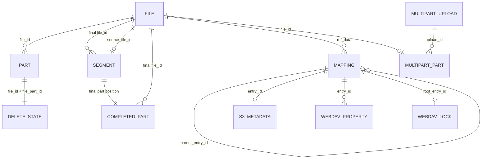
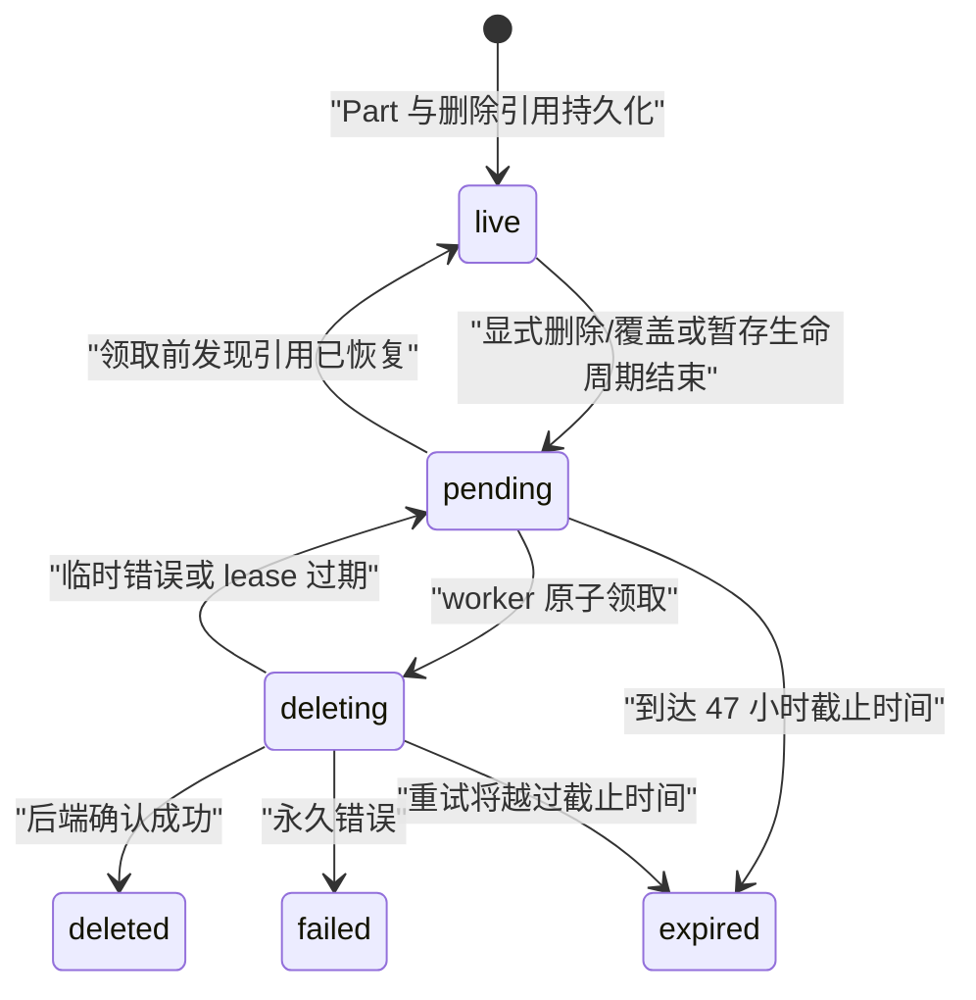

# 数据与存储模型

本文定义 tgfile 的持久化对象、关系、状态和兼容性不变量。组件职责见
[`01-architecture.md`](01-architecture.md)，接口流程见
[`03-core-flows-and-api.md`](03-core-flows-and-api.md)。

## 1. 对象关系



- File 是内部内容对象；
- Part 是按顺序保存的后端块；
- Segment 是 layout v2 Composite File 对 layout v1 source File 的有序引用；
- Completed Part 是 layout v2 对外暴露的永久 S3 Part 边界和 checksum manifest；
- Mapping 是路径树条目，文件条目通过十进制 `ref_data` 引用 File；
- S3 Metadata 绑定具体 Mapping，不绑定 File，因此同一内容的不同对象可以拥有不同元数据；
- WebDAV Property 和 Lock 绑定 Mapping，Change Journal 以规范路径保存变更与删除墓碑；
- Multipart Upload/Part 保存未完成上传和完成幂等所需的控制状态；
- Delete State 绑定 Part，保存可删除 Telegram message 的引用和 durable worker 状态。

数据库不使用外键表达这些关系，完整性由事务、唯一约束、审计和 FileManager 维护。

## 2. 业务表

### 2.1 `tg_file_tab`

| 字段 | 语义 |
|---|---|
| `file_id` | 内部稳定标识，唯一 |
| `file_size` | 完整文件字节数 |
| `file_part_count` | 按 BlockIO 单块上限计算的分片数 |
| `file_layout_version` | `1` 为物理 File，`2` 为 Composite File |
| `file_state` | 创建中或已就绪 |
| `extinfo` | JSON 扩展信息，包含兼容性文件 MD5 |
| `ctime`、`mtime` | 创建和修改时间 |

### 2.2 `tg_file_part_tab`

`(file_id, file_part_id)` 唯一，`file_part_id` 从零开始。本表只保存 layout v1 的物理
BlockIO Part；layout v2 不复制这些行。

| 字段 | 语义 |
|---|---|
| `file_key` | BlockIO 下载使用的不透明标识 |
| `file_part_md5` | 分片内容 MD5，属于存量格式 |
| `ctime`、`mtime` | 创建和修改时间 |

零字节 File 没有 Part。单分片 File 的文件级 MD5 等于分片 MD5；多分片 File 对按顺序
拼接的分片 MD5 十六进制文本再计算 MD5。MD5 只用于协议和存量兼容，不用于认证。

### 2.3 `tg_file_mapping_tab`

| 字段 | 语义 |
|---|---|
| `entry_id` | 路径条目的稳定标识 |
| `parent_entry_id`、`file_name` | 父子层级和当前层名称 |
| `file_kind` | `1` 为目录，`2` 为文件 |
| `ref_data` | 文件条目保存十进制 `file_id`，目录为空 |
| `file_size`、`file_mode` | 路径侧元数据 |
| `ctime`、`mtime` | 创建和修改时间 |

根条目为 `(parent_entry_id=0, file_name='/')`。`(parent_entry_id, file_name)` 和
`entry_id` 都有唯一约束。一个 File 可以被多个 Mapping 引用；是否允许删除 Telegram
内容由所有 Mapping 的最终引用判断决定。

### 2.4 `tg_s3_file_segment_tab`

layout v2 File 通过本表顺序引用 layout v1 source File：

| 字段 | 语义 |
|---|---|
| `file_id` | layout v2 final File |
| `segment_index` | 从 0 连续递增的逻辑顺序 |
| `source_file_id` | ready、layout v1 的 source File，全表唯一 |
| `segment_size` | source File 的完整大小 |
| `ctime`、`mtime` | manifest 记录时间 |

final File 的 `file_size` 必须等于所有 Segment Size 之和，`file_part_count` 必须等于所有
source File 物理 Part 数之和。Segment 不允许递归引用 layout v2。Complete 写入 final
File、Segment、Completed Part、Mapping、S3 Metadata 和 Multipart 状态的操作处于同一事务。

### 2.5 `tg_s3_completed_part_tab`

本表保存 Multipart Complete 后不随控制记录清理而消失的 S3 Part 语义：

| 字段 | 语义 |
|---|---|
| `file_id` | layout v2 final File |
| `part_number` | final PartNumber，从 1 连续递增 |
| `part_size` | Complete 时所选 source File 的完整大小 |
| `checksum_state` | `available` 或 `unavailable` |
| `checksum_algorithm` | checksum 可用时的固化 Multipart 算法，否则为空 |
| `checksum_value` | checksum 可用时已经验证的 Part checksum，否则为空 |
| `ctime`、`mtime` | manifest 记录时间 |

`(file_id, part_number)` 是主键。每个 Segment 必须恰好对应一行 Completed Part，并满足
`part_number = segment_index + 1`、`part_size = segment_size`，所有 Part Size 之和必须等于
final File Size。layout v1 不得拥有 Completed Part。

新完成的非 legacy Multipart 保存可解码的算法专用 checksum；legacy Multipart 以及无法从
历史控制记录可靠恢复 checksum 的存量 Segment 只保存准确的 Part 顺序和大小，并把 checksum
标记为 unavailable。迁移和读取都不得为补 checksum 而下载 Telegram 内容，也不得使用 ETag、
File MD5 或完整对象 checksum 冒充 Part checksum。

Completed Part 属于内容 File，不属于 Mapping。CopyObject 或 WebDAV COPY 复用同一 File 时
共享一份 manifest；删除、移动或覆盖 Mapping，以及 Multipart 控制记录过期清理，都不得删除
manifest。即使最后一个 Mapping 已移除并且底层 message 已删除，manifest 仍作为审计记录保留。

### 2.6 Multipart 控制表

`tg_s3_multipart_upload_tab` 保存 bucket/key、`active/completing/completed/aborted` 状态、
创建时对象元数据、发起/过期/完成/清理时间，以及 Complete 幂等所需的 fingerprint、
result FileID、Multipart ETag 和最终 checksum。checksum 字段为：

| 字段 | 语义 |
|---|---|
| `checksum_algorithm` | `CRC32/CRC32C/CRC64NVME/SHA1/SHA256`，legacy active Upload 为空 |
| `checksum_type` | `FULL_OBJECT/COMPOSITE`，legacy active Upload 为空 |
| `result_checksum_value` | Complete 后的最终返回值；COMPOSITE 包含 `-N` 后缀 |

`tg_s3_multipart_part_tab` 的 `(upload_id, part_number)` 为主键，保存：

- `active/selected/discarded` 状态；
- 对应 layout v1 暂存 FileID；
- S3 part 的真实大小、原文 MD5 ETag 和上传时间。
- Create 时所选算法对应的 `Base64(raw digest bytes)` checksum。

PartNumber 为 1～10000，单 part 最大 5 GiB。一个暂存 File 只能属于一个 Multipart Part。
active upload 和 completed/aborted 控制记录分别在 24 小时有效期与保留期后由专用 worker
处理；清理控制行不会删除 final File、Segment、Completed Part、Mapping、Telegram Part 或
删除审计记录。

### 2.7 `tg_s3_object_metadata_tab`

每个新 S3 对象 Mapping 对应一行：

| 字段 | 语义 |
|---|---|
| `entry_id` | 对应 Mapping 主键 |
| `etag` | 完整 HTTP ETag 文本 |
| `checksum_sha256` | 服务端对对象原文计算的 Base64 SHA-256 |
| `request_checksum_algorithm/value` | 对象的 additional checksum 算法和值；普通 PUT 来自已验证请求，Multipart 来自固化策略和服务端聚合 |
| `checksum_type` | additional checksum 的 `FULL_OBJECT/COMPOSITE` 聚合语义 |
| `content_type`、`cache_control` | 标准响应元数据 |
| `content_disposition/encoding/language` | 可选内容元数据 |
| `expires` | 规范化 HTTP date |
| `user_metadata` | 规范化后的 `x-amz-meta-*` JSON |
| `ctime`、`mtime` | 对象元数据时间 |

新 PUT 的 ETag 是对象原文 MD5 的小写十六进制强 ETag。CopyObject 的 COPY 模式复制源
元数据，REPLACE 模式替换可写元数据但保留内容 ETag 和 checksum。

新建 Multipart Upload 默认使用 `CRC64NVME/FULL_OBJECT`。CRC32/CRC32C 可使用
FULL_OBJECT 或 COMPOSITE；SHA1/SHA256 只使用 COMPOSITE；CRC64NVME 只使用
FULL_OBJECT。0009 之前创建且仍 active 的 Upload 通过空 algorithm/type 保持 legacy
语义，不伪造 Part 或最终 checksum。0009 之前由普通 PutObject 保存的 additional
checksum 都描述完整请求体，migration 只把其 `checksum_type` 元数据补为 FULL_OBJECT，
不读取或改写 File、Telegram message、对象字节、ETag 或 checksum 值。

Multipart 最终对象的 ETag 为标准组合值：

```text
hex(MD5(binary_md5(part1) || ... || binary_md5(partN))) + "-" + N
```

它不是整对象 MD5，因此 layout v2 File 的 `extinfo` 为 `{}`，普通文件元数据接口不把
Multipart ETag 冒充 MD5。

历史 Mapping 可能没有本表记录。读取时惰性生成：

- ETag：`W/"{file_id}"`；
- Content-Type：按扩展名推断，失败时为 `application/octet-stream`；
- Cache-Control：`public, max-age=604800`；
- 时间：使用 Mapping 时间。

惰性兼容不写数据库，也不改变历史内容和外部标识。

### 2.8 `tg_file_part_delete_state_tab`

`(file_id, file_part_id)` 为主键。

| 字段 | 语义 |
|---|---|
| `backend_kind` | 创建该 Part 的 BlockIO 实现名 |
| `delete_ref` | 版本化、不透明的后端删除引用 |
| `uploaded_at` | 后端确认的上传时间 |
| `delete_state` | `live/pending/deleting/deleted/expired/failed` |
| `attempt_count` | 已领取次数 |
| `next_attempt_at` | 下次可领取时间 |
| `lease_until` | `deleting` 租约截止时间 |
| `last_attempt_at/error_code` | 最近尝试的低基数结果 |
| `deleted_at` | 删除成功时间 |
| `ctime`、`mtime` | 状态记录时间 |

Part 与 Delete State 在同一个事务中插入；如果事务失败，FileManager 立即尝试补偿删除刚
上传的 message。带 Delete State 的 File 重新建立 Mapping 前必须确认已有状态均为
`live`；layout v2 的每个 source File 还必须为每个物理 Part 保存一条完整的 `live`
Delete State。历史 layout v1 File 缺少 Delete State 时继续允许存量 Copy，但无法承诺
物理删除 Telegram message。

状态变化：



终态不会自动清除 File/Part。普通 purge 也不能删除拥有 Delete State 的记录。

### 2.9 `tg_webdav_property_tab`

dead property 以 `(entry_id, namespace_uri, local_name)` 为主键，`value_xml` 保存 property
元素内部的 XML，`ctime/mtime` 保存属性记录时间。`DAV:` live properties 是受保护属性，
不写入本表。

WebDAV PUT 原地替换文件表示并保留 `entry_id`，因此保留该 URL 的 dead properties；COPY
为每个新 Mapping 复制属性，MOVE 保留属性，DELETE 和覆盖删除会在同一事务中删除属性。
S3 普通覆盖虽然重新创建 Mapping，但会在事务内把属性重新绑定到新 `entry_id`；S3
CopyObject 覆盖清理目标属性并复制源属性。属性行不得脱离 Mapping 成为孤立记录。

### 2.10 `tg_webdav_lock_tab`

第一版锁只支持 exclusive write，字段包括不透明 token、规范化 root path、root entry ID、
`0/infinity` depth、owner XML、principal、创建/过期时间和 lock-null 标记。同一路径最多
一个直接锁；depth infinity 锁对全部后代写操作生效。

锁创建、刷新、释放和写操作的 token 校验只访问 SQLite。对不存在 URL 的 LOCK 在父
collection 存在时创建零字节 lock-null Mapping；首次 PUT 会把它转成普通资源，未写入就
UNLOCK 或锁过期时会在事务内删除。MOVE 更新锁根路径，DELETE 和覆盖删除清理对应锁。
过期锁在任何锁相关访问前视为无效并顺带清理，不需要 Telegram 参与。

### 2.11 `tg_webdav_change_tab`

`revision` 是 SQLite AUTOINCREMENT 的全局单调版本，行同时保存规范路径、`created/updated/
deleted` 类型和时间。所有 Directory mutation 在同一业务事务中写 journal；删除行保留
tombstone，所以资源消失后仍可由 `sync-collection` REPORT 返回 404 response。

sync token 是携带 revision 的不透明 URI。服务按 collection root、Depth 和稳定 revision
顺序分页；初始同步先流式返回当前直接子项并签发快照 revision，增量同步只返回 token 后
每个路径的最新变化。高于当前 revision 或无法解析的 token 无效。

## 3. Migration 账本

`schema_migrations` 保存 `version`、`filename`、SQL 原文 SHA-256 和 `applied_at`。
业务 DDL 位于 `migrations/NNNN_name.sql`，按版本升序执行，SQL 和账本写入处于同一事务。

启动规划规则：

- 空库从 0001 初始化；
- 无账本数据库只在 schema 指纹精确匹配内置历史版本或明确 legacy 画像时建立基线；
- 已登记 migration 的文件名和 checksum 必须与二进制完全一致；
- 版本缺口、未知 migration、schema 漂移或无法识别的旧库都安全失败；
- 已发布 migration 不修改、删除、重命名或换序，新 DDL 只追加更高版本。

连接级 `busy_timeout` 属于运行参数，不属于业务 migration。

## 4. 路径与对象事务

S3 PUT、CopyObject、DeleteObject、Multipart Complete 和覆盖在 Directory 事务内完成：

- 最终条件检查；
- Mapping 创建、替换或删除；
- S3 Metadata 创建、复制、替换或删除；
- 被替换 File 的最终引用判断；
- 必要时把该 File 的 `live` Part 状态改为 `pending`。

同进程 path lock 减少冲突，SQLite 唯一约束和事务是跨进程最终一致性边界。

CopyObject 只创建指向同一 File 的新 Mapping。删除任一非最后引用不会改变 Delete State。

WebDAV PUT、DELETE 以及覆盖式 COPY/MOVE 也使用 FileManager 的 Directory 事务。目录操作
递归收集旧子树，原子更新 Mapping、S3 Metadata、dead properties、locks 和 change journal，
再按去重后的 FileID 判断最后引用。事务提交后才返回，Telegram 网络删除由 worker 异步
执行。

layout v1 File 的有效引用包括直接 Mapping、仍有 Mapping 的 Composite Segment 和 active
Multipart Part。layout v2 final File 的有效引用是 Mapping。删除 layout v2 的最后
Mapping 时逐一检查 source File；仍被有效 Mapping/Composite/active upload 引用的 source
不得进入 `pending`。

## 5. 直链 key

直链外部 key 格式为：

```text
{16 位小写十六进制 file_id 哈希}-{清洗和限长后的文件名}
```

内部规范路径为：

```text
/defaults/{哈希前两位}/{完整外部 key}
```

下载只解析该路径，不扫描其他根目录，也没有历史 fallback。`/defaults`、外部 key、FileKey、
`file_id` 和 Part 顺序是数据兼容边界。

## 6. 审计指标

只读 audit 除基础 File/Part/Mapping 完整性外，还报告：

- S3 Metadata 总数、孤立 Metadata 和每个 bucket 缺少 Metadata 的历史 Mapping 数；
- Delete State 各状态数量、最老 pending、过期 lease、48 小时内可处理数；
- Delete State 缺少 Part、backend kind 不匹配；
- private bucket FileID 是否同时出现在 public-read bucket 或 `/defaults`。
- Multipart upload/part 状态、过期 active upload、长期 completing 和孤立控制行；
- layout v2 manifest 连续性、Size/Part 数、source 状态与引用删除状态；
- 有效引用指向非 live File、无引用但仍 live 的暂存 File。
- Multipart algorithm/type 组合、legacy 空字段、active Part checksum、COMPOSITE `-N`
  结果和 completed result；
- Multipart result 与最终对象 Metadata 的一致性，以及对象 checksum 三元组的完整性。
- Completed Part 总数和 checksum state 分布；
- layout v2 缺失 Completed Part、layout v1 错误拥有 Completed Part、无 Segment 的孤立行；
- final PartNumber 连续性、Part/Segment Size 和 final File Size 一致性；
- Completed Part checksum 编码、控制记录和对象算法的一致性。

共享 FileID 指标用于发现 private 内容的其他公开入口；它不会自动修改 Mapping 或 ACL。

## 7. 数据兼容性不变量

不能静默改写：

- `file_id`、Part 顺序、FileKey、DeleteRef；
- 已持久化的文件/分片 MD5；
- Mapping 层级和 `ref_data`；
- 历史弱 ETag 和新对象强 ETag；
- 历史 File 的 layout 默认值 `1`，以及 Multipart 组合 ETag；
- layout v2 的 Segment 边界、永久 Completed Part 顺序/大小和已有 Part checksum；
- 直链 key 与 `/defaults` 映射；
- 已有内容使用的字节旋转参数。

改变这些值必须提供可重复迁移、停服前置检查、备份恢复和迁移后验证。
