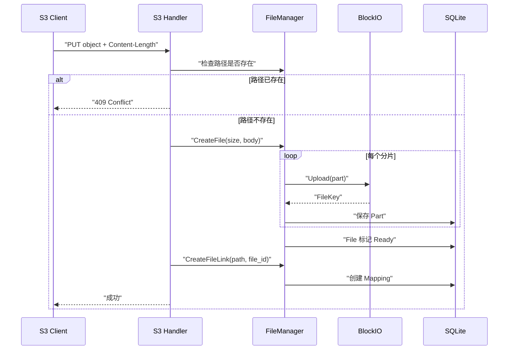

# 核心流程与接口设计

本文描述 tgfile 对外接口的稳定语义及其在内部组件间的处理流程。系统分层见
[`01-architecture.md`](01-architecture.md)，持久化约束见
[`02-data-and-storage-model.md`](02-data-and-storage-model.md)。

## 1. 接口边界

| 能力 | 路由或命令 | 鉴权 | 稳定语义 |
|---|---|---|---|
| S3 上传 | `PUT /{bucket}/{object}` | 是 | 创建新对象；已存在路径返回冲突，不覆盖 |
| S3 下载 | `GET /{bucket}/{object}` | 否 | 流式返回对象内容，支持 Range |
| S3 元数据 | `HEAD /{bucket}/{object}` | 否 | 返回大小、修改时间和 ETag，不读取完整内容 |
| 直链上传 | `POST /file/upload` | 是 | 创建文件并返回稳定外部 key |
| 直链下载 | `GET /file/download/{key}` | 否 | 按规范 key 路径流式读取，支持 Range |
| 直链元数据 | `GET /file/meta/{key}` | 否 | 返回文件大小等元数据 |
| 元数据清理 | `POST /file/purge` | 是 | 清理满足条件且无 Mapping 引用的 SQLite 元数据 |
| 目录浏览 | `/static/*` | 是 | 浏览和下载目录树中的内容 |
| 备份导入导出 | `/backup/import`、`/backup/export` | 是 | 以 tar.gz 在实例间传输逻辑文件树 |
| WebDAV | `/webdav/*` | 是 | 将配置的内部根路径映射为 WebDAV 文件树 |
| 只读审计 | `tgfile audit` | 本地命令 | 只读检查数据库一致性，不启动在线依赖 |
| 直链 key 检查 | `tgfile check-key` | 本地命令 | 只校验并解析 key，不访问数据库或后端 |

受保护的 HTTP 接口使用配置中的用户信息完成认证。S3 写请求使用 S3 Signature V4；普通
HTTP 接口使用 Basic Auth。读取接口是否公开是协议的一部分，部署时还应通过 TLS、反向
代理和访问控制保护传输与暴露范围。

## 2. S3 PUT 流程

请求必须带合法 `Content-Length`，因为分片数和每片预期长度在读取请求体前确定。handler
对同一进程内的相同路径串行化写入；SQLite 的父目录与文件名唯一约束处理跨进程竞争。

S3 PUT 采用“只创建”语义。若建链阶段失败，已上传 File 可能成为无引用对象；接口不能因
补偿失败而删除未知范围的后端内容。

## 3. 直链上传流程

`POST /file/upload` 接收 multipart 文件并复用 `CreateFile`。文件就绪后，handler：

1. 根据 `file_id` 生成 16 位小写十六进制哈希；
2. 清洗并限制原始文件名长度；
3. 生成 `{hash}-{filename}` 外部 key；
4. 在 `/defaults/{hash 前两位}/` 下创建 Mapping；
5. 将外部 key 返回给调用方。

文件内容一旦创建成功但 Mapping 创建失败，也可能留下无引用对象。直链 key 的格式和内部
映射规则属于持久化兼容协议，详见
[`02-data-and-storage-model.md`](02-data-and-storage-model.md#5-路径与直链-key)。

## 4. 读取、HEAD 与 Range

读取流程对 S3 和直链接口一致：

1. 将外部对象路径或直链 key 转换为规范 Mapping 路径；
2. 从目录树解析 `file_id`，读取 File 和有序 Part 元数据；
3. 对符合大小策略的文件依次查询 L1、L2 缓存；
4. 缓存未命中时，根据游标计算分片序号和块内偏移；
5. 使用 Part 的 FileKey 从 BlockIO 获取流，跨分片连续读取；
6. 将可重建的完整小文件回填缓存；
7. 通过 HTTP 内容服务处理 `Range`、`Content-Length` 和修改时间。

HEAD 只读取 Mapping 和 File 元数据，不应拉取完整后端内容。文件级 MD5 用于表达当前
ETag，但它不是强安全校验。

## 5. 路径并发与错误语义

- 所有外部路径在进入 Directory 前必须清理并规范化；
- 文件与同名目录不能同时存在，父目录内名称由 SQLite 唯一约束保护；
- S3 已存在对象返回 `409 Conflict`，不能隐式覆盖；
- 不存在的路径或 key 返回未找到，不回退到其他根目录；
- 请求取消必须传播到数据库和 BlockIO；
- handler 将业务错误映射为协议状态码，不能把凭据、FileKey 或内部路径泄露给客户端；
- 上传是非幂等操作，除非后端提供明确幂等键，否则不能自动重试整个上传。

## 6. 辅助能力

### 6.1 WebDAV

WebDAV 把外部 `/webdav` 映射到配置的内部根目录，支持读取、写入、建目录、删除、复制和
移动等文件树操作。它与 S3 共用同一 Mapping 和 FileManager，因此必须遵守相同的路径
冲突和内容持久化规则。

### 6.2 备份

导出接口遍历逻辑路径树，将文件内容以 tar.gz 流式输出；导入接口读取同一逻辑格式并重新
创建 File 和 Mapping。该能力是逻辑文件迁移，不是 SQLite、配置或 BlockIO 的逐字节灾备。

### 6.3 元数据清理

Purge 只处理达到时间条件且不再被 Mapping 引用的 File/Part 元数据。由于 BlockIO 不提供
删除能力，它不会回收后端块。生产清理仍需以审计、备份、明确范围和可验证恢复方案为前提。

## 7. 命令设计

每种运行模式使用独立 Cobra 子命令：

- `serve`：启动完整在线服务；
- `audit`：以只读方式审计 SQLite；
- `check-key`：离线检查直链 key。

仅服务端使用的参数属于 `serve`，只读审计和纯计算参数分别属于各自子命令。新增独立运行
模式时应增加子命令，不把不相关参数继续堆叠到根命令，也不让离线命令初始化在线依赖。
