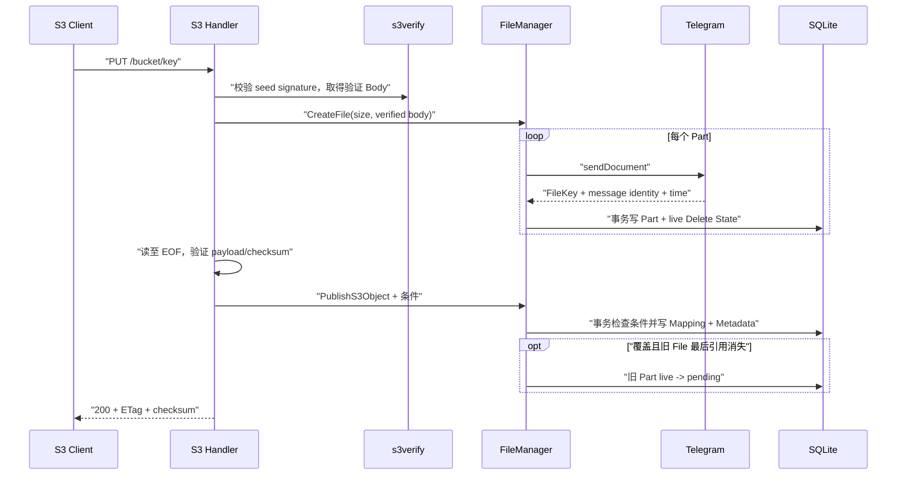

# 核心流程与接口设计

本文描述 tgfile 当前稳定的协议语义。架构边界见
[`01-architecture.md`](01-architecture.md)，持久化模型见
[`02-data-and-storage-model.md`](02-data-and-storage-model.md)。

## 1. S3 能力

| 能力 | 路由 | 认证 |
|---|---|---|
| ListBuckets | `GET /` | 必需 |
| HeadBucket | `HEAD /{bucket}` | 必需 |
| GetBucketLocation | `GET /{bucket}?location` 或 legacy bucket GET | 必需 |
| ListObjectsV2 | `GET /{bucket}?list-type=2` | 必需 |
| GetObject / HeadObject | `GET/HEAD /{bucket}/{key}` | 由 bucket ACL 决定 |
| PutObject | `PUT /{bucket}/{key}` | 必需 |
| CopyObject | `PUT /{bucket}/{key}` + `x-amz-copy-source` | 必需 |
| DeleteObject | `DELETE /{bucket}/{key}` | 必需 |
| DeleteObjects | `POST /{bucket}?delete` | 必需 |

不实现 bucket 创建/删除、对象 ACL、版本控制、multipart upload、tagging、lifecycle 和
SelectObjectContent。相关 bucket 操作返回 NotImplemented；`x-amz-acl` 和 grant header
返回 AccessControlListNotSupported。

## 2. SigV4 与请求完整性

S3 请求可以使用 Basic Auth、SigV4 Authorization header 或 SigV4 presigned query。
SigV4 固定使用 region `us-east-1`、service `s3`，凭据来自 `user_info`。

本地 `s3verify` 完成：

- canonical URI、query、header、credential scope、session token 和时间窗口校验；
- 普通 signed payload SHA-256；
- `UNSIGNED-PAYLOAD`；
- signed aws-chunked；
- signed aws-chunked + trailer；
- unsigned aws-chunked + trailer。

handler 只能读取 verifier 返回的 Body，并且必须成功读到 EOF 后才能发布 Mapping。
streaming 模式校验每个 chunk、签名链、解码长度和 trailer；应用层另外校验
`x-amz-trailer` 声明的对象 checksum，不能只验证 trailer 签名。

认证错误使用稳定 S3 XML code，不在响应或日志中暴露 secret、Authorization、签名或
完整后端引用。

## 3. PutObject

对象 key 必须是有效 UTF-8，最长 1024 字节，拒绝空段、`.`、`..`、反斜杠、控制字符和
首尾 `/`。请求必须提供普通 Content-Length 或 streaming decoded length，且不能超过
配置的 `max_object_size`。

上述完整规则用于新建 PUT/COPY 目标。历史对象的 GET/HEAD、DELETE 和 COPY 源允许读取
既有非规范名称，但仍拒绝空段、`.`、`..` 和首尾 `/`；任何可能被路径清理折叠到其他
bucket 的别名都返回 InvalidObjectName，不能以历史兼容绕过 bucket ACL。

支持：

- 标准覆盖；
- `If-None-Match: *`；
- `If-Match: *` 或单个强 ETag；
- Content-MD5；
- CRC32、CRC32C、CRC64NVME、SHA1、SHA256 request checksum；
- `x-amz-sdk-checksum-algorithm` 与实际 header/trailer 一致性；
- Content-Type、Cache-Control、Content-Disposition、Content-Encoding、
  Content-Language、Expires 和受限 `x-amz-meta-*`。

服务端始终计算对象原文的强 MD5 ETag 和 Base64 SHA-256。checksum、payload 或 trailer
验证失败时不发布 Mapping；已经成功上传但未被引用的 File 由 audit 暴露，不猜测性删除。

## 4. GetObject、HeadObject 与条件请求

GET/HEAD 返回 ETag、Last-Modified、Content-Type、Cache-Control、可选内容元数据、用户
元数据和 checksum。HEAD 不读取 Telegram 内容。

支持：

- 单 Range、206、Content-Range 和越界 416；
- `If-Match`、`If-None-Match`；
- `If-Modified-Since`、`If-Unmodified-Since`；
- `If-Range`。

ETag 列表只接受 `*` 或合法逗号分隔 tag；畸形值返回 InvalidArgument。历史弱 ETag 可以
满足弱 `If-None-Match`，不能满足具体值的强 `If-Match`。ETag 条件优先于日期条件，时间
比较按秒。

private bucket 在查询 Mapping 前拒绝匿名请求；public-read bucket 仅允许匿名对象 GET/HEAD。
提交了错误凭据的请求不会降级为匿名。

## 5. ListObjectsV2

支持 `prefix`、空 delimiter 或 `/`、`max-keys` 0..1000、`start-after`、
`continuation-token`、`encoding-type=url` 和 `fetch-owner`。重复单值参数、无效组合和
不支持的值返回 InvalidArgument。

SQLite 递归 CTE 只扫描配置 bucket 路径，prefix 使用转义后的参数化 LIKE。delimiter
投影产生去重 CommonPrefixes，结果按 key 排序并只读取 `max-keys + 1` 项。

continuation token 是严格解码的 Base64URL JSON，绑定版本、bucket、prefix、delimiter 和
最后一项；未知字段、超长值或与当前请求不匹配都返回 InvalidToken。

## 6. CopyObject

CopyObject 只在 SQLite 中新增对源 File 的引用，不下载或重新上传 Telegram 内容。
源和目标必须是已配置 bucket，写操作必须认证。为避免同进程死锁，源/目标 path lock
按排序后的路径获取；SQLite 事务处理跨进程竞争。

- COPY：复制源对象元数据和 checksum；
- REPLACE：使用请求元数据替换可写元数据，保留内容 ETag/checksum；
- 支持源条件 header 和目标 `If-Match`/`If-None-Match`；
- 同 key COPY 不改变内容；同 key REPLACE 原子更新元数据；
- 目标覆盖移除旧 Mapping，只有旧 File 最后引用消失时才进入删除队列。

请求新的 checksum 算法但源元数据无法直接复用时返回 NotImplemented，不为此读取完整内容。

## 7. DeleteObject 与 DeleteObjects

DeleteObject 是幂等逻辑删除：不存在对象仍返回 204。它只删除目标 Mapping 和 S3 Metadata；
不删除 File、Part 或目录树中的其他对象。`If-Match` 可约束删除。

DeleteObjects：

- 必须使用精确 `?delete`；
- XML body 最大 2 MiB；
- 必须提供正确 Content-MD5；
- 每次 1..1000 个 Object；
- XML 只允许 Delete/Object/Key/ETag/Quiet 结构；
- 每个 Object 独立事务，返回 Deleted 或逐项 Error；
- Quiet 模式省略成功项。

当操作移除某 File 的最后一个 Mapping 时，对应 `live` Delete State 在同一事务中变为
`pending`。worker 批量删除 Telegram message；429 使用 retry_after，网络错误和 5xx
指数退避且不越过 47 小时截止时间，永久错误按单条拆分隔离。

## 8. 直链与其他 HTTP 能力

| 能力 | 路由 | 认证 |
|---|---|---|
| 直链上传 | `POST /file/upload` | Basic |
| 直链下载 | `GET /file/download/{key}` | 匿名 |
| 直链元数据 | `GET /file/meta/{key}` | 匿名 |
| 元数据 purge | `POST /file/purge` | Basic |
| 静态目录 | `/static/*` | Basic |
| 逻辑备份 | `/backup/import`、`/backup/export` | Basic |
| WebDAV | `/webdav/*` | Basic |

直链下载只使用规范 `/defaults` 映射。Purge 只清理无引用且没有 Delete State 的旧 File；
不会丢弃 durable 删除引用或删除 Telegram message。

## 9. 命令

每种运行模式使用独立 Cobra 子命令：

- `serve --config=...`：校验配置、执行 migration、启动 HTTP 和 worker；
- `check-config --config=...`：仅解析和校验配置，无日志、数据库或网络副作用；
- `audit --config=... --output=...`：只读审计 SQLite；
- `check-key --key=...`：纯计算校验直链 key。

离线命令不得初始化 Telegram、缓存或 HTTP 服务。根命令不接受把不同运行模式混在一起的
业务参数。
