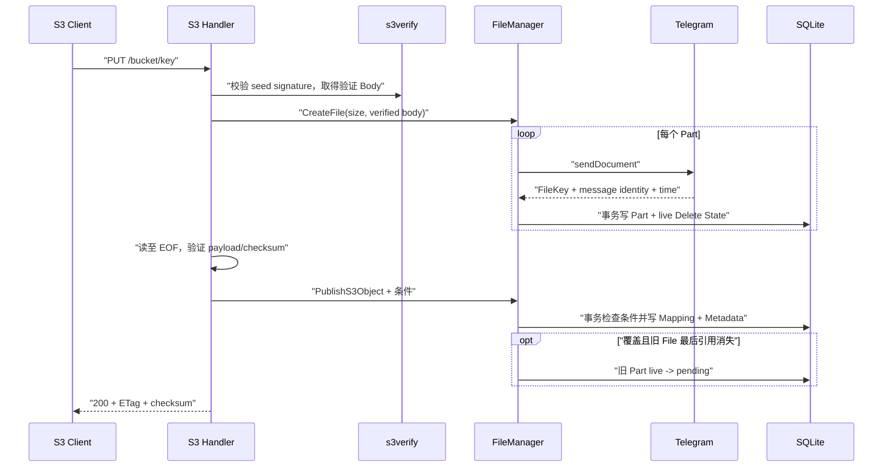

# 核心流程与接口设计

本文描述 tgfile 当前稳定的协议语义。架构边界见
[`01-architecture.md`](01-architecture.md)，持久化模型见
[`02-data-and-storage-model.md`](02-data-and-storage-model.md)。

## 1. S3 能力

| 能力 | 路由 | 认证 |
|---|---|---|
| ListBuckets | `GET /` | `s3:read` |
| HeadBucket | `HEAD /{bucket}` | `s3:read` |
| GetBucketLocation | `GET /{bucket}?location` 或 legacy bucket GET | `s3:read` |
| ListObjects V1 | `GET /{bucket}/` 或不带 `list-type` 的列表 query | `s3:read` |
| ListObjectsV2 | `GET /{bucket}?list-type=2` | `s3:read` |
| GetObject / HeadObject | `GET/HEAD /{bucket}/{key}` | public-read 可匿名，否则 `s3:read` |
| GetObjectAttributes | `GET /{bucket}/{key}?attributes` | public-read 可匿名，否则 `s3:read` |
| PutObject | `PUT /{bucket}/{key}` | `s3:write` |
| CopyObject | `PUT /{bucket}/{key}` + `x-amz-copy-source` | `s3:write` |
| DeleteObject | `DELETE /{bucket}/{key}` | `s3:write` |
| DeleteObjects | `POST /{bucket}?delete` | `s3:write` |
| CreateMultipartUpload | `POST /{bucket}/{key}?uploads` | `s3:write` |
| UploadPart | `PUT /{bucket}/{key}?partNumber=N&uploadId=ID` | `s3:write` |
| ListParts | `GET /{bucket}/{key}?uploadId=ID` | `s3:read` |
| CompleteMultipartUpload | `POST /{bucket}/{key}?uploadId=ID` | `s3:write` |
| AbortMultipartUpload | `DELETE /{bucket}/{key}?uploadId=ID` | `s3:write` |
| ListMultipartUploads | `GET /{bucket}?uploads` | `s3:read` |

`GET`、`HEAD` 和 `POST` bucket 操作同时接受 `/{bucket}` 与 `/{bucket}/`，尾斜杠不得被
解释为空对象 key。精确的无 query `GET /{bucket}` 保留旧 LocationConstraint 响应；
`GET /{bucket}/` 表示 ListObjects V1。DeleteObjects 同时接受
`POST /{bucket}?delete` 和 `POST /{bucket}/?delete`。

S3 endpoint 只支持 path-style 寻址。签名协议只支持 SigV4，不支持 SigV2、SigV4a、
virtual-hosted-style bucket、Multi-Region Access Point 和 browser-based POST policy。
客户端必须关闭对象 ACL 探测或接受未实现 ACL subresource 的 NotImplemented 响应；
预签名 URL 必须由支持 SigV4 的客户端生成。

不实现 bucket 创建/删除、对象 ACL、版本控制、tagging、lifecycle 和
SelectObjectContent。Multipart 不实现 UploadPartCopy、SSE 和对象 ACL，对应请求稳定返回
NotImplemented。其他未实现的标准 bucket/object subresource
在鉴权后也返回 NotImplemented，不能进入普通对象 I/O，也不能因空对象 key 返回
InvalidObjectName；普通 PutObject 的 `x-amz-acl` 和 grant header 返回
AccessControlListNotSupported。

## 2. SigV4 与请求完整性

S3 请求可以使用 Basic Auth、SigV4 Authorization header 或 SigV4 presigned query。
SigV4 固定使用 region `us-east-1`、service `s3`，凭据来自 `user_info`。三种认证形式
使用相同的 `s3:read` / `s3:write` 授权；public-read 对象只有完全未携带认证信息时才
跳过权限判断，携带有效但无 S3 权限的凭据仍返回 AccessDenied。

本地 `s3verify` 完成：

- canonical URI、query、header、credential scope、session token 和时间窗口校验；
- 普通 signed payload SHA-256；
- `UNSIGNED-PAYLOAD`；
- signed aws-chunked；
- signed aws-chunked + trailer；
- unsigned aws-chunked + trailer。

handler 只能读取 verifier 返回的 Body，并且必须成功读到 EOF 后才能发布 Mapping。
streaming 模式校验每个 chunk、签名链、解码长度和 trailer；应用层另外校验
`x-amz-trailer` 声明的对象或 Part checksum，不能只验证 trailer 签名。checksum header
属于 canonical request；public-read ACL 不改变签名和 checksum 规则。

认证错误使用稳定 S3 XML code，不在响应或日志中暴露 secret、Authorization、签名或
完整后端引用。

## 3. PutObject

对象 key 必须是有效 UTF-8，最长 1024 字节，拒绝空段、`.`、`..`、反斜杠、控制字符和
首尾 `/`。请求必须提供普通 Content-Length 或 streaming decoded length，且不能超过
配置的 `max_object_size`。

上述完整规则用于新建 PUT/COPY 目标。历史对象的 GET/HEAD、DELETE 和 COPY 源允许读取
既有非规范名称，但仍拒绝空段、`.`、`..` 和首尾 `/`；任何可能被路径清理折叠到其他
bucket 的别名都返回 InvalidObjectName，不能以历史兼容绕过 bucket ACL。

支持：

- 标准覆盖；
- `If-None-Match: *`；
- `If-Match: *` 或单个强 ETag；
- Content-MD5；
- CRC32、CRC32C、CRC64NVME、SHA1、SHA256 request checksum；
- `x-amz-sdk-checksum-algorithm` 与实际 header/trailer 一致性；
- Content-Type、Cache-Control、Content-Disposition、Content-Encoding、
  Content-Language、Expires 和受限 `x-amz-meta-*`。

服务端始终计算对象原文的强 MD5 ETag 和 Base64 SHA-256。checksum、payload 或 trailer
验证失败时不发布 Mapping；已经成功上传但未被引用的 File 通过 durable outbox 进入异步
删除，不能遗失删除引用或直接绕过状态机。

## 4. Multipart Upload

Multipart 的六个核心 API 默认随 S3 启用，没有额外服务端开关。public-read bucket 只
允许匿名 GetObject、HeadObject 和 GetObjectAttributes，所有 Multipart API 必须认证；
ListParts 和 ListMultipartUploads 要求 `s3:read`，其余 Multipart 变更要求 `s3:write`。

每个 UploadPart 使用普通文件创建流程保存成 layout v1 暂存 File，S3 part 可以为
0～5 GiB，PartNumber 为 1～10000，允许乱序上传和相同编号覆盖。单个 S3 part 在 Telegram
中仍按 20 MiB BlockIO 上限拆成多个 message。Part ETag 是 part 原文字节的 MD5；覆盖旧
part 时，旧暂存 File 在事务中进入 durable 删除队列。

CreateMultipartUpload 支持 `x-amz-checksum-algorithm` 和 `x-amz-checksum-type`，并在
Upload 生命周期内固化选择：

| 请求 | 固化结果 |
|---|---|
| 都未指定，或只指定 FULL_OBJECT | `CRC64NVME/FULL_OBJECT` |
| CRC64NVME，未指定 type | `CRC64NVME/FULL_OBJECT` |
| CRC32/CRC32C/SHA1/SHA256，未指定 type | 对应算法的 `COMPOSITE` |
| CRC32/CRC32C + FULL_OBJECT | 对应算法的 `FULL_OBJECT` |

算法和 type 使用精确大写枚举。未知算法返回 InvalidArgument；已定义但未实现的
MD5/SHA512/XXHash 返回 NotImplemented；非法组合返回 InvalidRequest。Create 成功响应
通过 header 返回最终 algorithm/type。0009 之前仍 active 且字段为空的 Upload 保持
legacy 行为，不要求也不返回 additional checksum。

UploadPart 在读取 body 前通过 FileManager 校验 UploadId、bucket/key、状态和过期时间，
取得固化策略。支持算法对应的 checksum header、`x-amz-sdk-checksum-algorithm` 和
aws-chunked checksum trailer。SDK algorithm 必须匹配固化算法，并且必须伴随 header 或
trailer；header 与 trailer 同时存在时必须使用同一算法和值。COMPOSITE 要求客户端提交
每个 Part checksum；FULL_OBJECT 可省略，但服务端始终流式计算并保存。Base64、摘要长度
或内容校验失败时不登记 Part，暂存 File 通过 durable outbox 补偿。成功响应始终返回
ETag 和所选算法的 checksum。

ListParts 对非 legacy Upload 返回 algorithm/type，并在每个 Part 返回唯一对应的
ChecksumCRC32、ChecksumCRC32C、ChecksumCRC64NVME、ChecksumSHA1 或 ChecksumSHA256。
ListMultipartUploads 在每个非 legacy Upload 项返回其固化 algorithm/type。

Complete 请求：

- XML body 最大 2 MiB，PartNumber 必须严格递增，ETag 和可选 Part checksum 必须匹配；
- 除选择列表最后一个 part 外，每个 part 至少 5 MiB；
- FULL_OBJECT 和 legacy 允许选择已上传 part 的非连续子集；COMPOSITE 必须从 1 连续；
- COMPOSITE 的每个 XML Part 必须提交固化算法对应的 checksum；FULL_OBJECT 可省略；
- 可提交最终算法 checksum、`x-amz-checksum-type` 和 `x-amz-mp-object-size`，均须匹配；
- `If-Match`/`If-None-Match` 在最终 SQLite 事务内判断；
- 创建 layout v2 Composite File、有序 Segment 和永久 Completed Part manifest，原子发布
  Mapping；
- 不下载、复制或重新上传 Telegram message；
- 未选择 part 在同一事务中进入删除队列。

Completed Part 使用 Complete 后的连续编号，不保留客户端可能非连续的原 UploadPart 编号。
非 legacy Upload 把已经验证的 Part checksum 固化为 available；legacy Upload 固化准确的
Part 顺序和大小，但 checksum 为 unavailable。写入 final File、Segment、Completed Part、
Mapping、S3 Metadata 和完成控制记录处于同一事务，Complete 过程中不读取 Telegram。

FULL_OBJECT 只用于 CRC。服务端根据每个 Part 的 CRC 和字节数做 GF(2) combine，结果等于
直接对完整对象计算 CRC；COMPOSITE 对按顺序 Base64 解码后的原始 Part digest 拼接后再次
计算所选算法，持久化与响应值带 `-N` 后缀。Complete 不读取或重组 Telegram message。
最终 algorithm/type/value 与 Mapping、对象 Metadata 和 completed 控制记录一次事务提交。

最终 ETag 使用标准 Multipart 组合 ETag并带 `-N` 后缀，不代表整对象 MD5。相同规范化
Part 列表的 Complete 在控制记录保留期内可幂等重试；不同列表、已 Abort 或不存在的
UploadId 返回 NoSuchUpload。幂等重试仍校验 Part checksum、最终 checksum、type 和 size，
不一致不能重放为成功。

Abort 把 active part 标记为 discarded，并通过 durable outbox 异步删除暂存 message；
重复 Abort 返回 204。active upload 从创建起最多保留 `s3.multipart_expire_hours`
（默认 24 小时），过期处理与 Abort 相同。completed/aborted 控制记录再保留 24 小时后
仅清理控制行，不删除 Completed Part manifest。

layout v2 的读取由统一 `OpenFile` 按 Segment 定位 source File，支持完整读取、任意 Seek
和跨 S3 part/Telegram part 的 Range。因此 Multipart 最终对象可以被 S3 GET/HEAD/Copy/
Delete、文件直链、WebDAV、管理后台、备份和 check-key 使用。

ListParts 支持 `part-number-marker/max-parts`，ListMultipartUploads 支持 prefix、`/`
delimiter、key/upload marker、`max-uploads`，并接受 s3cmd 的 `max-keys` 兼容别名和
`encoding-type=url`。

## 5. GetObject、HeadObject 与条件请求

GET/HEAD 返回 ETag、Last-Modified、Content-Type、Cache-Control、可选内容元数据、用户
元数据和 checksum。HEAD 不读取 Telegram 内容。

`x-amz-checksum-mode` 只接受 `ENABLED`。有 additional checksum Metadata 的对象返回唯一
算法对应的 checksum 和 `x-amz-checksum-type`；历史无 Metadata 对象不现场读取 Telegram
补算。为兼容既有 PutObject 客户端，未显式 checksum mode 时仍保留已有 checksum header
返回行为。206 Range 响应不返回完整对象 checksum，避免客户端把局部响应与完整对象摘要
比较；If-Range 不匹配而回退到 200 时仍返回完整对象 checksum。

支持：

- 单 Range、206、Content-Range 和越界 416；
- `If-Match`、`If-None-Match`；
- `If-Modified-Since`、`If-Unmodified-Since`；
- `If-Range`。

ETag 列表只接受 `*` 或合法逗号分隔 tag；畸形值返回 InvalidArgument。历史弱 ETag 可以
满足弱 `If-None-Match`，不能满足具体值的强 `If-Match`。ETag 条件优先于日期条件，时间
比较按秒。

private bucket 在查询 Mapping 前拒绝匿名请求；public-read bucket 仅允许匿名对象 GET、
HEAD 和 GetObjectAttributes。提交了错误凭据的请求不会降级为匿名。

### 5.1 响应头覆盖

GetObject 和 HeadObject 支持以下精确、大小写敏感的 query：

| Query | 响应 Header |
|---|---|
| `response-cache-control` | `Cache-Control` |
| `response-content-disposition` | `Content-Disposition` |
| `response-content-encoding` | `Content-Encoding` |
| `response-content-language` | `Content-Language` |
| `response-content-type` | `Content-Type` |
| `response-expires` | `Expires` |

每个参数只能出现一次，值不能为空、不能超过 8192 字节，也不能包含 HTTP 控制字符。
`response-expires` 接受 HTTP 支持的三种日期格式并统一输出 IMF-fixdate。

覆盖值只应用到最终 `200 OK` 对象响应；Range 或非零 Part GET 的 206、304、412、404 和其他
错误响应都不得携带覆盖值。零字节唯一 Part 的 GET 和所有成功 Head Part 都是 200，因此可以
应用覆盖值。覆盖值只改变本次响应，不写 S3 Metadata 或缓存。

即使 bucket 是 public-read，只要出现任一 response override 就必须认证。Basic、SigV4
Authorization 和 SigV4 presigned query 均可使用；override query 属于签名 canonical query，
修改预签名 URL 中的值会导致 SignatureDoesNotMatch。匿名直接拼接 override query 返回
AccessDenied。

### 5.2 `partNumber` 对象读取

GetObject 和 HeadObject 接受单值十进制 `partNumber=1..10000`，不能与 Range 同时出现。
编号高于对象实际 Part 数时返回 `416 InvalidPartNumber`，错误 XML 只附加请求编号和实际
Part 总数，不暴露 FileID 或 source File。

layout v1 始终只有一个 S3 Part，不受底层 Telegram message 数量影响：

- `partNumber=1` 表示完整对象；
- 非零字节 GET 返回 206 和相对于完整对象的 Content-Range；
- HEAD 返回 200；
- 零字节对象 GET/HEAD 返回 200、Content-Length 0 且省略 Content-Range；
- `partNumber>1` 返回 416。

layout v2 的 final PartNumber 是 `segment_index + 1`，因此从 1 连续递增，不等同于客户端
原始 UploadPart 编号。每次 Part GET 只打开目标 Segment 的 source File；一个 S3 Part 可以
继续跨多个 Telegram message。GET 返回 206、Part Content-Length、相对于完整对象的
Content-Range 和 `x-amz-mp-parts-count`；HEAD 返回相同元数据但状态为 200，并且不读取
Telegram。

Part 响应保留完整对象 ETag 和对象元数据，但不返回完整对象 checksum。只有显式
`x-amz-checksum-mode: ENABLED` 时才返回 Part checksum：layout v1 的唯一 Part 可以复用
完整对象 checksum；layout v2 只返回 Completed Part manifest 中 available 的固化 checksum，
unavailable 时省略且不得现场读取 Telegram 补算。

### 5.3 GetObjectAttributes

GetObjectAttributes 使用 `GET /{bucket}/{key}?attributes`。`attributes` 必须出现一次且值
为空，可伴随单值 `x-id`；与 Multipart query、`partNumber`、response override 冲突时返回
InvalidRequest，与 `versionId` 组合返回 NotImplemented。

请求必须提供 `x-amz-object-attributes`，其值是以下大小写敏感枚举的非空逗号列表：
`ETag`、`Checksum`、`ObjectParts`、`StorageClass`、`ObjectSize`。允许逗号两侧 OWS，不允许
空项、未知项或重复项。响应只包含明确请求的根字段，始终返回 Last-Modified，StorageClass
固定为 STANDARD，XML namespace 固定为 `http://s3.amazonaws.com/doc/2006-03-01/`。

ObjectParts 分页 Header：

- `x-amz-max-parts` 缺省 1000，范围 0..1000；
- `x-amz-part-number-marker` 缺省 0，范围 0..10000；
- 只返回 PartNumber 大于 marker 的行，按升序查询 `max-parts + 1` 行判断截断；
- `max-parts=0` 返回空页、`IsTruncated=false` 且没有 NextPartNumberMarker；
- PartsCount 是完整对象的 Part 总数，不是当前页数量。

layout v1 即使请求 ObjectParts 也省略整个容器。layout v2 使用永久 Completed Part 的编号和
大小；对象存在 additional checksum 时返回 Part 元素，manifest checksum available 时增加
唯一算法字段，unavailable 时只返回编号和大小。legacy Multipart 没有对象 additional
checksum，因此保留 ObjectParts 分页元数据但省略 Part 元素。该接口以及 Head Part 只访问
SQLite，不读取 Telegram。

GetObject、HeadObject 和 GetObjectAttributes 记录低基数的 operation、read mode、结果码、
attributes 集合、manifest checksum state 和分页状态；日志不记录完整对象 key、response
override 值或 presigned query。

### 5.4 内容缓存与读取失败语义

S3 完整对象/Range、文件直链、WebDAV、管理后台和备份最终都通过同一个
`FileManager.OpenFile`，因而共享 File 版本身份和 L1/L2 内容缓存；layout v1 与 layout v2
使用相同语义。HEAD、GetObjectAttributes、List 和 PROPFIND 只读取元数据，不为提高命中率
打开内容或触发回填。

对符合缓存阈值的冷读，缓存按声明的完整 File 大小回填后再由协议层 Seek/读取，因此 Range
仍能得到标准 206 和 Content-Range，但首次回源可能读取完整 File。同一 File 版本的并发
S3、直链或 WebDAV 冷读合并为一个回填；每个响应取得独立 reader，取消其中一个等待请求
不影响其他请求。

缓存命中和回填不改变 ETag、checksum、Last-Modified、Content-Length、条件请求或 Range
语义。L2 文件丢失、截断、扩展、摘要不符或本地写/open/rename 失败时，该 entry 只会失效并
进入正常回源；回源成功时协议响应仍成功。BlockIO/Composite 数据源短于声明大小时错误链
包含 `io.ErrUnexpectedEOF`，长于声明大小时返回 source-size mismatch；两者都不发布 L1、
L2 或残留 temp。请求 context 取消优先返回取消错误，已取消请求不会为了完成缓存回填继续
阻塞。

任何读取、命中、miss、损坏清理或回填降级都不能修改 File、Part、Mapping、S3/WebDAV
元数据或 durable delete outbox，也不能调用 BlockIO 删除。

## 6. ListObjects V1 与 V2

ListObjects V1 用于兼容仍使用旧列表协议的客户端。支持 `prefix`、空 delimiter 或 `/`、
`marker`、`max-keys` 0..1000 和 `encoding-type=url`。响应包含 V1 的 Marker，并在 delimiter
分页时返回 NextMarker；没有 delimiter 时客户端可以使用当前页最后一个 Key 继续请求。
V1 Contents 始终包含稳定 Owner。

ListObjects V2 支持 `prefix`、空 delimiter 或 `/`、`max-keys` 0..1000、`start-after`、
`continuation-token`、`encoding-type=url` 和 `fetch-owner`。重复单值参数、无效组合和
不支持的值返回 InvalidArgument。

V1 与 V2 复用同一个 FileManager 列表实现。SQLite 递归 CTE 只扫描配置 bucket 路径，
prefix 使用转义后的参数化 LIKE。delimiter 投影产生去重 CommonPrefixes，结果按 key
排序并只读取 `max-keys + 1` 项。列表始终要求认证，即使 bucket 是 public-read。
对象存在 additional checksum Metadata 时，V1/V2 Contents 同时返回
ChecksumAlgorithm/ChecksumType；列表不读取 Telegram 或现场计算历史对象 checksum。

V2 continuation token 是严格解码的 Base64URL JSON，绑定版本、bucket、prefix、delimiter
和最后一项；未知字段、超长值或与当前请求不匹配都返回 InvalidToken。V1 marker 和 V2
start-after/continuation token 最终都映射为同一严格大于起点的有序查询。

## 7. CopyObject

CopyObject 只在 SQLite 中新增对源 File 的引用，不下载或重新上传 Telegram 内容。
源和目标必须是已配置 bucket，写操作必须认证。为避免同进程死锁，源/目标 path lock
按排序后的路径获取；SQLite 事务处理跨进程竞争。

- COPY：复制源对象元数据和 checksum；
- REPLACE：使用请求元数据替换可写元数据，保留内容 ETag/checksum；
- 支持源条件 header 和目标 `If-Match`/`If-None-Match`；
- 同 key COPY 不改变内容；同 key REPLACE 原子更新元数据；
- 目标覆盖移除旧 Mapping，只有旧 File 最后引用消失时才进入删除队列。

CopyObject 成功响应返回复用后的算法专用 checksum 和 ChecksumType。请求新的 checksum
算法但源元数据无法直接复用时返回 NotImplemented，不为此读取完整内容。

## 8. DeleteObject 与 DeleteObjects

DeleteObject 是幂等逻辑删除：不存在对象仍返回 204。它只删除目标 Mapping 和 S3 Metadata；
不删除 File、Part 或目录树中的其他对象。`If-Match` 可约束删除。

DeleteObjects：

- 必须使用精确 `?delete`；
- XML body 最大 2 MiB；
- 必须提供正确 Content-MD5，或现代 AWS SDK/CLI 生成的 supported additional checksum；
- 每次 1..1000 个 Object；
- XML 只允许 Delete/Object/Key/ETag/Quiet 结构；
- 每个 Object 独立事务，返回 Deleted 或逐项 Error；
- Quiet 模式省略成功项。

当操作移除某 File 的最后一个 Mapping 时，对应 `live` Delete State 在同一事务中变为
`pending`。worker 批量删除 Telegram message；429 使用 retry_after，网络错误和 5xx
指数退避且不越过 47 小时截止时间，永久错误按单条拆分隔离。

## 9. 直链与其他 HTTP 能力

| 能力 | 路由 | 认证 |
|---|---|---|
| 直链上传 | `POST /file/upload` | Basic + `file:write` |
| 直链下载 | `GET /file/download/{key}` | 匿名 |
| 直链元数据 | `GET /file/meta/{key}` | 匿名 |
| 元数据 purge | `POST /file/purge` | Basic + `file:write` |
| 逻辑备份 | `/backup/v2/*` | Basic + `backup:read/write` |
| WebDAV Class 1/2 + sync | `/webdav/*` | Basic + `webdav:read/write` |
| Web 管理后台 | `/_admin/*` | `admin:read/write` 派生的管理 Session + CSRF |

直链下载只使用规范 `/defaults` 映射。Purge 只清理无引用且没有 Delete State 的旧 File；
不会丢弃 durable 删除引用或删除 Telegram message。

WebDAV 使用 Basic Auth，并通过 `webdav.root` 映射同一棵路径树。它提供强 ETag 条件读取/
写入、原子 PUT、Depth 受限的 PROPFIND、dead properties、exclusive write LOCK/UNLOCK、
逻辑 quota 和 `sync-collection`。GET、HEAD、Range、COPY 和 MOVE 对 layout v1/v2 透明；
未知长度 PUT 经磁盘 spool 获得最终大小后再进入现有分片上传。DELETE 或覆盖在同一 SQLite
事务中更新 Mapping、S3 Metadata、WebDAV 协议状态、最后引用和 durable outbox。完整协议
语义见 [`04-webdav-protocol.md`](04-webdav-protocol.md)。

逻辑备份使用版本化 `.tgfb` 归档和持久化异步 Job。它保存 layout v1 Part 边界、
layout v2 Segment、Completed Part、S3 Metadata 和 WebDAV dead property；恢复时生成新的
内部 FileID、EntryID、FileKey 和 DeleteRef，并在单一 SQLite 事务发布全部路径和协议
元数据。完整格式、API、权限和恢复语义见
[`05-logical-backup.md`](05-logical-backup.md)。

Web 管理后台内嵌于服务二进制，提供路径浏览、下载、条件上传、Export、Import 和 Job 管理。
它使用独立的进程内 Session、严格 Origin/CSRF 校验和由 `admin:read/write` 派生的
`read`/`read-write` 角色，不复用
协议入口的 Basic Auth 会话。管理上传发布为普通 Mapping，因此 S3、WebDAV 和管理入口
立即看到同一内容；管理下载透明读取 layout v1 和 layout v2。完整语义见
[`06-web-management.md`](06-web-management.md)。

## 10. 命令

每种运行模式使用独立 Cobra 子命令：

- `serve --config=...`：校验配置、执行 migration、启动 HTTP、删除 worker 和 Multipart
  过期清理 worker；
- `check-config --config=...`：仅解析和校验配置，无日志、数据库或网络副作用；
- `audit --config=... --output=...`：只读审计 SQLite；
- `check-key --key=...`：纯计算校验直链 key。
- `backup export --config=... --scope=... --output=...`：生成并验证逻辑归档；
- `backup verify --config=... --input=...`：不连接数据库和后端的离线校验；
- `backup import --config=... --input=... --conflict=...`：恢复并等待持久化 Job 终态。

`check-config`、`audit`、`check-key` 和 `backup verify` 不得初始化 Telegram、缓存或
HTTP 服务。`backup export/import` 需要数据库和配置的 BlockIO，但不启动 HTTP。根命令
不接受把不同运行模式混在一起的业务参数。
