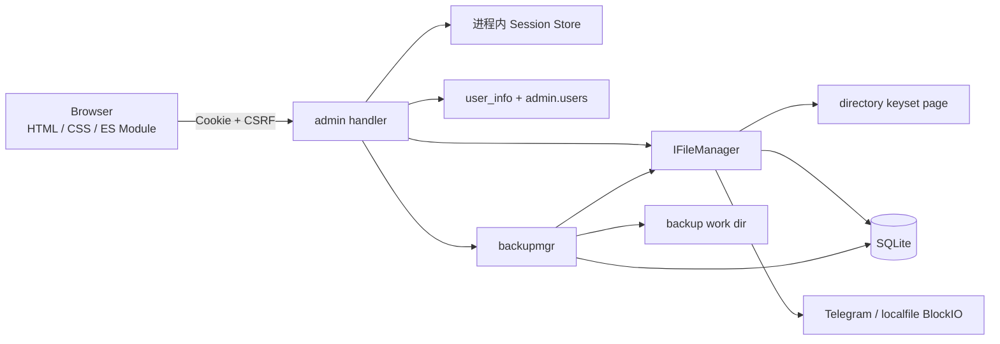

# Web 管理后台

本文定义 tgfile 内嵌 Web 管理后台的稳定架构、安全边界、接口语义和数据一致性约束。
系统组件关系见 [`01-architecture.md`](01-architecture.md)，文件与路径模型见
[`02-data-and-storage-model.md`](02-data-and-storage-model.md)，逻辑备份状态机见
[`05-logical-backup.md`](05-logical-backup.md)。

## 1. 能力与边界

管理入口固定为 `/_admin/`，由 tgfile 进程直接提供 HTML、CSS、原生 ES Module 和
`/_admin/api/v1`。它支持：

- 使用内置 `user_info` 账号登录；
- 按绝对 Mapping 路径分页浏览目录和查看元数据；
- 下载普通 File 和 Multipart Composite File；
- 上传空文件、普通文件和需要多个 BlockIO Part 的文件；
- 使用强 ETag 创建或覆盖 Mapping；
- 创建、浏览、取消和下载逻辑 Export；
- 上传 `.tgfb`、执行 dry-run 或正式 Import；
- 按管理角色隔离写操作、其他用户 Job 和 artifact。

管理后台不提供用户、bucket、配置、Telegram message 或服务生命周期管理，不暴露
FileKey、DeleteRef、Bot Token、内部 FileID、Part 或 work dir 路径。它不替代 S3、
WebDAV、文件直链或直接 Backup API；所有入口操作同一棵 Mapping 树和同一组 File。

## 2. 组件关系



Admin handler 不直接读写 DAO 或业务表。目录读取经 FileManager 进入 directory，上传与覆盖
复用 WebDAV 的条件发布事务，导入导出复用 backupmgr。这样管理入口不会形成第二套引用、
删除、备份或恢复语义。

## 3. 配置与启用

顶层配置为：

```json
{
  "user_info": {
    "viewer": "viewer-password",
    "operator": "operator-password"
  },
  "external_origin": [
    "https://files.example.com",
    "https://image.example.com"
  ],
  "admin": {
    "enable": true,
    "users": {
      "viewer": "read",
      "operator": "read-write"
    },
    "session_idle_minutes": 30,
    "session_max_hours": 12,
    "max_upload_size": 5368709120
  }
}
```

- `enable` 缺省为 false；关闭时不注册任何 `/_admin` 路由。
- 顶层 `external_origin` 是管理后台和 WebDAV 共用的数组；启用管理后台时必填，包含
  1～32 个没有 userinfo、path、query 和 fragment 的 HTTP(S) origin。规范化后不得重复，
  所有项必须使用同一种 scheme。生产只接受 HTTPS；HTTP 只允许 localhost 或 loopback IP。
- `users` 至少包含一个已存在于 `user_info` 且密码非空的账号，角色只能为 `read` 或
  `read-write`。
- `session_idle_minutes` 缺省 30，范围 5～120。
- `session_max_hours` 缺省 12，范围 1～24 小时，并且必须长于 idle timeout。
- `max_upload_size` 缺省优先取正数 `s3.max_object_size`，否则为 5 GiB；有效范围为
  1 B～10 TiB，并受 Telegram 最大 Part 数约束。

`admin.enable` 和 `backup.enable` 独立控制 HTTP 路由。任一开启都会创建并运行同一个
backupmgr；只有 `backup.enable` 开启时才暴露 `/backup/v2`。

顶层 `external_origin` 列表是 Cookie Secure 和 Origin 比较的唯一事实来源。共同 scheme
决定 Cookie 的 Secure 属性；请求 Origin 必须精确命中规范化后的任一列表项。服务不使用
`Forwarded`、`X-Forwarded-Host` 或 `X-Forwarded-Proto` 推导管理安全边界。

## 4. 角色模型

| 操作 | `read` | `read-write` |
|---|---:|---:|
| 登录、刷新会话、退出 | 是 | 是 |
| 浏览和下载任意 Mapping | 是 | 是 |
| 创建 Export | 是 | 是 |
| 查看、下载自己的 Export | 是 | 是 |
| 取消自己的活动 Export | 是 | 是 |
| 查看或取消其他用户 Job | 否 | 是 |
| 上传或覆盖文件 | 否 | 是 |
| dry-run 或正式 Import | 否 | 是 |

管理角色仅作用于 `/_admin`。S3 bucket ACL、`webdav.users` 和 `backup.users` 继续独立控制
对应协议入口。public-read bucket 也不能绕过管理 Session。

## 5. 登录、Session 与浏览器安全

### 5.1 登录

`POST /_admin/api/v1/session` 接受最大 16 KiB 的严格 JSON：

```json
{"username":"operator","password":"operator-password"}
```

请求必须使用 `application/json`，并且 `Origin` 精确命中规范化后的
`external_origin` 列表。
解析拒绝未知字段、重复字段、尾随值、非法 UTF-8、空账号和空密码。用户名最大 256 字节，
密码最大 4096 字节；值按原始字节比较，不 trim 或执行 Unicode normalization。

账号必须同时存在于 `user_info` 和 `admin.users`。服务分别计算提交密码和预期密码的
SHA-256，再对固定长度摘要做常量时间比较；未知或无管理权限的账号使用随机 dummy 摘要。
所有认证失败返回相同的 `401 invalid_credentials`，至少延迟 250 ms。

登录按“直接对端 IP + 用户名”的摘要限制五分钟内失败次数，并有进程级每分钟尝试上限。
服务不信任代理转发的客户端 IP，限流表有固定容量和惰性过期清理。

### 5.2 Session

成功登录生成独立的 32 字节随机 Session token 和 CSRF token。服务端只保存 Session token
的 SHA-256，记录 username、role、CSRF、创建时间、最后访问时间和绝对到期时间。

Cookie 固定为：

```text
tgfile_admin_session=<opaque>;
HttpOnly;
SameSite=Strict;
Path=/_admin/;
Secure 仅用于 HTTPS origin
```

Cookie 不设置 Domain 或持久化到期时间。合法 API 请求滑动 idle 时间，但不延长 absolute
expiry。进程最多保存 1024 个活动 Session，每用户最多 8 个；第九次登录撤销最旧 Session。
服务重启和配置变更后的重启会使全部 Session 失效。

Cookie 是当前域名的 host-only Cookie，不在 `external_origin` 的不同域名之间共享。用户从
另一个允许域名访问时需要独立登录；两个域名生成的 Session 仍受同一进程级容量与每用户
上限约束。

`GET /_admin/api/v1/session` 恢复当前 Session 并返回 CSRF token；
`DELETE /_admin/api/v1/session` 要求正确 Origin 和 CSRF，删除服务端记录并以相同 Path
清除 Cookie。

### 5.3 CSRF、CORS 与响应

除登录外，所有 POST、PUT、DELETE 管理请求必须同时满足：

- `Origin` 与 `external_origin` 列表中的一项完全一致；
- `X-CSRF-Token` 与 Session 中的 token 常量时间一致。

服务不返回 CORS 允许 header，也不处理跨域 credential。HTML 和 API 设置 `no-store`；
HTML、静态资源、JSON、文件和 artifact 响应设置 `nosniff`、禁止 frame、严格
Referrer-Policy 和 Permissions-Policy。页面 CSP 只允许同源脚本、样式、连接和
`data:` 图片，不允许 inline script、object、base URI 或第三方资源。

管理 API 的访问日志路径和 query 在进入通用日志中间件前统一替换为
`/_admin/api/_redacted_`，路由执行前再恢复原始请求目标。密码、Cookie、CSRF、完整路径、
下载 key 和 artifact 本地路径不写日志。

每个管理 API 请求另写一条结构化审计日志，字段固定包含 request ID、路由模板、用户名、
角色、动作、HTTP 状态、结果、请求与响应字节数和耗时；适用时包含 job ID。文件资源只记录
路径 SHA-256 和顶层命名空间，不记录完整路径。内部错误只记录错误类型，原始 cause 不进入
日志，避免后端路径、SQL 或凭据经错误链泄露。

## 6. API 公共约定

除文件内容和 artifact 外，成功响应使用：

```json
{"data":{}}
```

错误响应使用固定可展示消息：

```json
{
  "error": {
    "code": "precondition_failed",
    "message": "目标已发生变化",
    "request_id": "..."
  }
}
```

公开错误不能拼接 SQL、路径、用户名或后端错误。请求 JSON、query、路径、分页 cursor 和
幂等键都有固定大小和字符约束；未知 query、重复 query、未知 JSON 字段和尾随 JSON
安全失败。

外部路径必须是规范绝对 POSIX 路径：以 `/` 开头，根以外不以 `/` 结尾，
`path.Clean(value) == value`，拒绝反斜线、控制字符、非法 UTF-8 和超长值。URL query
只解码一次，percent 编码后的文本不会再次解释为路径分隔符。

## 7. 文件浏览与下载

### 7.1 Stat 与列表

```text
GET /_admin/api/v1/entries/stat?path=/absolute/path
GET /_admin/api/v1/entries?path=/directory&limit=100&cursor=...
```

entry DTO 只包含 name、path、kind、size、ctime、mtime 和文件强 ETag。目录 ETag 为空。
列表 limit 缺省 100，范围 1～500，不计算总数。

排序固定为目录优先，再按 `file_name COLLATE BINARY` 和 `entry_id` 升序。分页 cursor 是
版本化的 Base64 Raw URL JSON，包含 parent entry ID 和最后一个
`file_kind/file_name/entry_id` tuple。查询使用 keyset 和 `limit + 1`，只读取当前目录的
直接子项。目录在两页之间删除重建时，parent entry ID 改变，旧 cursor 返回
`409 cursor_stale`。

该分页是请求间弱一致的：不保持长 SQLite snapshot，并发插入、删除或重命名可能使一次
跨请求遍历出现遗漏或重复；刷新后得到当前目录状态。

### 7.2 下载

```text
GET|HEAD /_admin/api/v1/content?path=/absolute/file
```

下载根据 Mapping 的不可变 FileID 打开内容，设置强 ETag、Last-Modified、安全的
`Content-Disposition: attachment`、由文件名推导的 Content-Type 和
`Cache-Control: private, no-store`。它支持 HEAD、单 Range、If-Range 和标准 HTTP
条件请求，并透明读取 layout v1 与 layout v2 Composite。客户端取消会通过 request
context 中止后端读取，不创建本地内容副本。

## 8. 上传与条件覆盖

```text
PUT /_admin/api/v1/content?path=/absolute/file
Content-Length: ...
If-None-Match: *
X-CSRF-Token: ...
```

新建必须使用 `If-None-Match: *`；覆盖必须使用当前 Stat 返回的单个强 `If-Match`。
缺少或混用条件返回 428，最终事务内目标状态与条件不一致返回 412。父目录必须已存在，
目标不能是目录。

请求必须有已知 Content-Length，可以为零，不得超过 `admin.max_upload_size`。handler
先调用 `CreateFile` 完成 BlockIO 分片，再调用 `PublishWebDAVFile` 在单一事务发布 Mapping。
覆盖保留 entry ID 和 WebDAV dead properties，刷新默认 S3 metadata。

发布失败使用独立限时 context 调用 `DiscardUnpublishedFile`。覆盖失去最后引用的旧 File
只会在同一事务把 live Delete State 改为 pending；共享 Mapping、Composite、Multipart
或活动 Export Pin 仍引用旧 File 时不得删除。成功响应不等待 Telegram 删除。

管理上传不生成 `/file/download/{key}`。需要直链 key 时仍使用现有直链上传接口。

## 9. 导入导出

### 9.1 Job 列表与权限

```text
GET /_admin/api/v1/backup/jobs?limit=50&cursor=...&kind=export&state=succeeded&owner=operator
GET /_admin/api/v1/backup/jobs/{job_id}
POST /_admin/api/v1/backup/jobs/{job_id}/cancel
```

列表按 `created_at DESC, job_id DESC` keyset 分页，limit 范围 1～200。kind 只能为空、
`export` 或 `import`，state 只能为空或状态机中的合法状态。read 用户的 owner 固定为自己；
read-write 可以查看全部或指定 owner。DTO 不返回 artifact/report 本地路径或内部
fingerprint。

read 只能访问自己的 Job，并且只能取消自己的活动 Export；read-write 可以访问和取消任意
可取消 Job。publishing 或终态 Job 不可取消。

### 9.2 Export

```text
POST /_admin/api/v1/backup/exports
Idempotency-Key: <unique>
Content-Type: application/json

{"scope":"/"}
```

scope 必须是存在的规范绝对路径，owner 固定为 Session username。创建返回 202，后续通过
Job API 查询。完成的 artifact 使用：

```text
GET|HEAD /_admin/api/v1/backup/exports/{job_id}/artifact
```

artifact 支持 Range 和条件请求，返回 `.tgfb` 媒体类型、SHA-256 ETag、
`X-Tgfile-Artifact-SHA256` 和安全下载文件名。

### 9.3 Import

```text
POST /_admin/api/v1/backup/imports?conflict=fail&dry_run=true
Idempotency-Key: <unique>
Content-Type: application/vnd.tgfile.backup.v2+tar+gzip
Content-Length: ...

<tgfb bytes>
```

Import 仅允许 read-write。conflict 只能为 `fail` 或 `replace`；正式 replace 还要求
`X-Tgfile-Confirm-Replace: true`。浏览器不需要预先计算 SHA-256：backupmgr 在写入
`.partial` 时流式计算，fsync 后原子 rename，再把实际摘要持久化到 Job 并进入 queued。

同一 owner、kind 和 Idempotency-Key 且 conflict、dry-run、Content-Length 相同，表示同一
逻辑上传；调用方不能把同一个 key 用于不同文件。后续结构、资源上限、Part 摘要、S3
checksum、BlockIO 和冲突验证与直接 Backup API 完全相同。dry-run 不上传 BlockIO 或创建
Mapping；正式 Import 使用不可见 staged File 和单一 SQLite 发布事务。

## 10. 数据库与一致性

管理后台不新增 Session 表，不回填或改写历史 File、Part、Mapping、S3 Metadata、
WebDAV 状态、FileKey 或 DeleteRef。数据库只增加三个分页索引：

```sql
CREATE INDEX idx_tg_file_mapping_admin_page
ON tg_file_mapping_tab (
    parent_entry_id,
    file_kind,
    file_name COLLATE BINARY,
    entry_id
);

CREATE INDEX idx_tg_backup_job_admin_page
ON tg_backup_job_tab (created_at DESC, job_id DESC);

CREATE INDEX idx_tg_backup_job_admin_owner_page
ON tg_backup_job_tab (owner, created_at DESC, job_id DESC);
```

索引由正常 migration 事务创建。旧程序忽略这些索引；索引存在不改变历史行、对象字节、
外部路径、ETag 或协议行为。

文件创建、条件发布、引用切换和删除 outbox 仍由 FileManager 维护。Import 接收中断会删除
partial/final artifact 并使 Job 进入安全状态；queued 后的失败与重启恢复遵循持久化 Job
状态机。Session 重启失效不影响已经持久化的 Job。

## 11. 前端实现

UI 使用语义化 HTML、CSS Grid/Flex 和原生 ES Module，通过 `go:embed` 随二进制发布。
它没有 npm、CDN、远程字体、第三方脚本、inline handler、`eval` 或客户端路由。

密码仅存在于登录表单和登录请求，成功或失败后清空；Session token 是 HttpOnly Cookie，
CSRF 只保存在页面内存。页面不使用 localStorage、sessionStorage、IndexedDB 或
`document.cookie`。文件名、路径和服务端消息只通过 `textContent` 写入 DOM。

数据页提供 breadcrumb、有界“加载更多”、串行多文件上传、覆盖确认和进度/取消。备份页
提供 scope Export、Import 文件选择、dry-run、replace 二次确认、Job 轮询、artifact 下载
和取消。轮询在页面隐藏时暂停，并从一秒退避到五秒。

## 12. 兼容性不变量

- 管理功能默认关闭，关闭时不改变现有路由、认证或 worker。
- 管理上传生成普通 layout v1 File，所有现有读取协议可以立即读取。
- 管理下载透明支持存量 layout v1 和 Multipart layout v2。
- 管理 Import 使用现有 `.tgfb` v2，不引入第二种归档或恢复语义。
- Session 不持久化，不进入 SQLite 备份或逻辑备份。
- 管理角色、S3 ACL、WebDAV 角色和直接 Backup 角色彼此独立。
- 读取、浏览、登录、Session 清理和 migration 不触发 Telegram 删除。
- 覆盖和 Import replace 只能通过 durable outbox 处理失去最后引用的后端 message。
